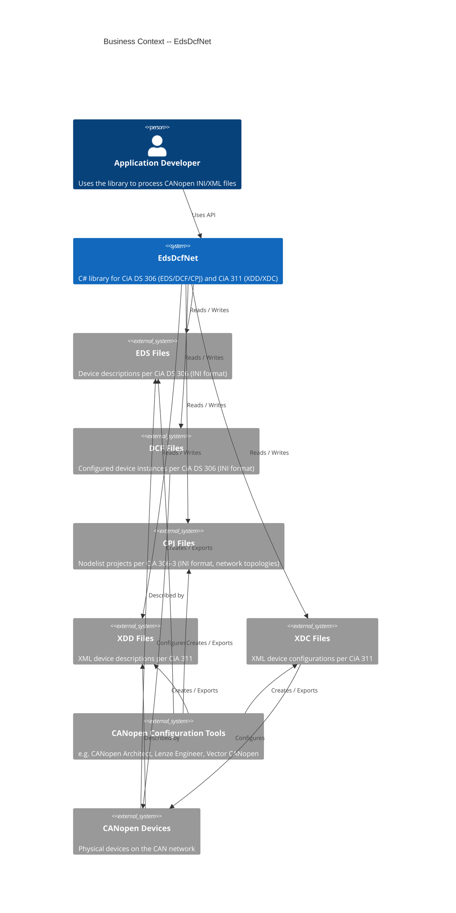
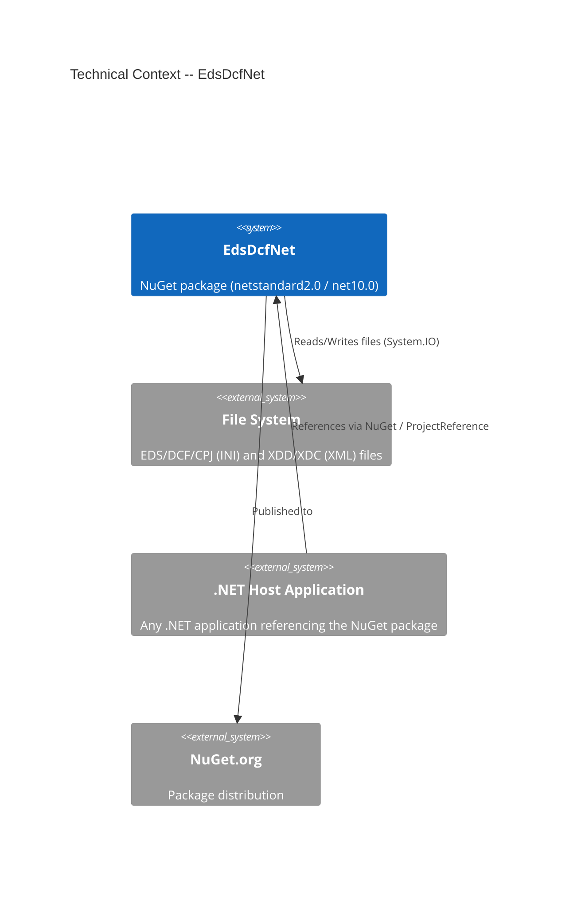

# 3. Context and Scope

## 3.1 Business Context

The following diagram shows how EdsDcfNet fits into its business environment:

```mermaid
C4Context
    title Business Context -- EdsDcfNet

    Person(developer, "Application Developer", "Uses the library to process CANopen INI/XML files")

    System(edsdcfnet, "EdsDcfNet", "C# library for CiA DS 306 (EDS/DCF/CPJ) and CiA 311 (XDD/XDC)")

    System_Ext(eds_files, "EDS Files", "Device descriptions per CiA DS 306 (INI format)")
    System_Ext(dcf_files, "DCF Files", "Configured device instances per CiA DS 306 (INI format)")
    System_Ext(cpj_files, "CPJ Files", "Nodelist projects per CiA 306-3 (INI format, network topologies)")
    System_Ext(xdd_files, "XDD Files", "XML device descriptions per CiA 311")
    System_Ext(xdc_files, "XDC Files", "XML device configurations per CiA 311")
    System_Ext(canopen_tools, "CANopen Configuration Tools", "e.g. CANopen Architect, Lenze Engineer, Vector CANopen")
    System_Ext(canopen_devices, "CANopen Devices", "Physical devices on the CAN network")

    Rel(developer, edsdcfnet, "Uses API")
    Rel(edsdcfnet, eds_files, "Reads / Writes")
    Rel(edsdcfnet, dcf_files, "Reads / Writes")
    Rel(edsdcfnet, cpj_files, "Reads / Writes")
    Rel(edsdcfnet, xdd_files, "Reads / Writes")
    Rel(edsdcfnet, xdc_files, "Reads / Writes")
    Rel(canopen_tools, eds_files, "Creates / Exports")
    Rel(canopen_tools, cpj_files, "Creates / Exports")
    Rel(canopen_tools, xdd_files, "Creates / Exports")
    Rel(canopen_tools, xdc_files, "Creates / Exports")
    Rel(canopen_devices, eds_files, "Described by")
    Rel(canopen_devices, xdd_files, "Described by")
    Rel(dcf_files, canopen_devices, "Configures")
    Rel(xdc_files, canopen_devices, "Configures")
```

### External Interfaces

| Interface            | Description                                                                  |
|----------------------|------------------------------------------------------------------------------|
| **EDS files**        | Input/Output: INI-formatted device descriptions per CiA DS 306. Can be read, created, and written. |
| **DCF files**        | Input/Output: Configured device instances. Can be read, created, and written. |
| **CPJ files**        | Input/Output: CiA 306-3 nodelist projects describing network topologies. Can be read, created, and written. |
| **XDD files**        | Input/Output: XML device descriptions per CiA 311. Can be read and written. |
| **XDC files**        | Input/Output: XML device configurations per CiA 311. Can be read and written. |
| **NuGet consumers**  | The library is distributed as a NuGet package and used through the public API (`CanOpenFile`). |

## 3.2 Technical Context

```mermaid
C4Context
    title Technical Context -- EdsDcfNet

    System(edsdcfnet, "EdsDcfNet", "NuGet package (netstandard2.0 / net10.0)")

    System_Ext(filesystem, "File System", "EDS/DCF/CPJ (INI) and XDD/XDC (XML) files")
    System_Ext(dotnet_host, ".NET Host Application", "Any .NET application referencing the NuGet package")
    System_Ext(nuget, "NuGet.org", "Package distribution")

    Rel(dotnet_host, edsdcfnet, "References via NuGet / ProjectReference")
    Rel(edsdcfnet, filesystem, "Reads/Writes files (System.IO)")
    Rel(edsdcfnet, nuget, "Published to")
```

### Technical Interfaces

| Channel                | Protocol / Format                              | Description                                                              |
|------------------------|------------------------------------------------|--------------------------------------------------------------------------|
| **File system**        | System.IO (UTF-8 read/write, no BOM on write)  | Reading/writing EDS/DCF/CPJ (INI) and XDD/XDC (XML) as UTF-8 text (without BOM on writes) |
| **String API**         | In-memory UTF-16 strings                       | `Read*FromString` / `Write*ToString` variants for EDS/DCF/CPJ/XDD/XDC in scenarios without file system access |
| **NuGet package**      | `.nupkg` + `.snupkg`                           | Distribution via nuget.org with Source Link                              |
