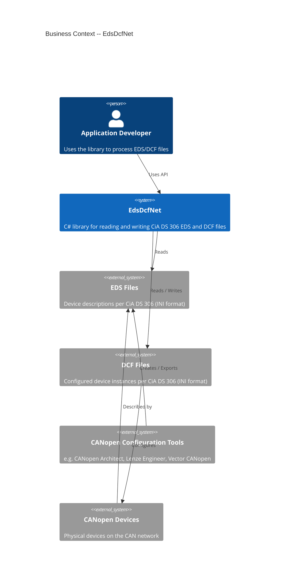
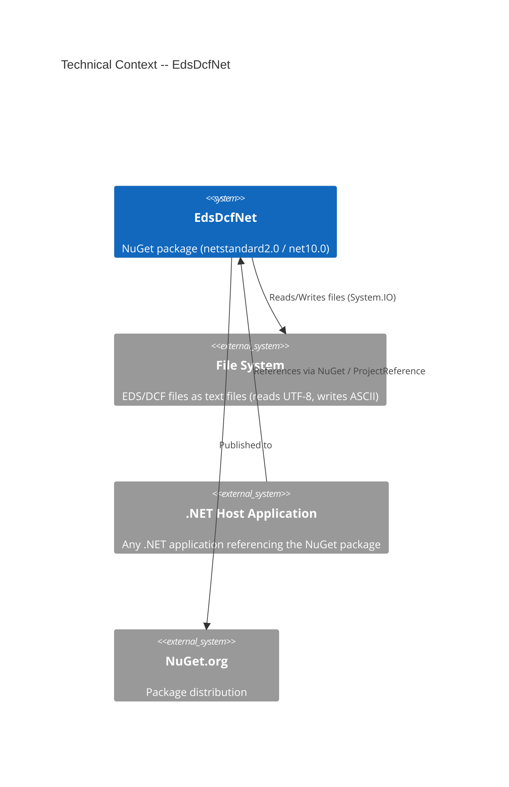

# 3. Context and Scope

## 3.1 Business Context

The following diagram shows how EdsDcfNet fits into its business environment:

### External Interfaces

| Interface            | Description                                                                  |
|----------------------|------------------------------------------------------------------------------|
| **EDS files**        | Input: INI-formatted device descriptions per CiA DS 306. Provided by device manufacturers. |
| **DCF files**        | Input/Output: Configured device instances. Can be read, created, and written. |
| **NuGet consumers**  | The library is distributed as a NuGet package and used through the public API (`CanOpenFile`). |

## 3.2 Technical Context

### Technical Interfaces

| Channel                | Protocol / Format                              | Description                                                              |
|------------------------|------------------------------------------------|--------------------------------------------------------------------------|
| **File system**        | System.IO (UTF-8 read, ASCII write)            | Reading EDS/DCF as UTF-8 text, writing DCF as ASCII-encoded text         |
| **String API**         | In-memory UTF-16 strings                       | `ReadEdsFromString` / `WriteDcfToString` for scenarios without file system access |
| **NuGet package**      | `.nupkg` + `.snupkg`                           | Distribution via nuget.org with Source Link                              |
