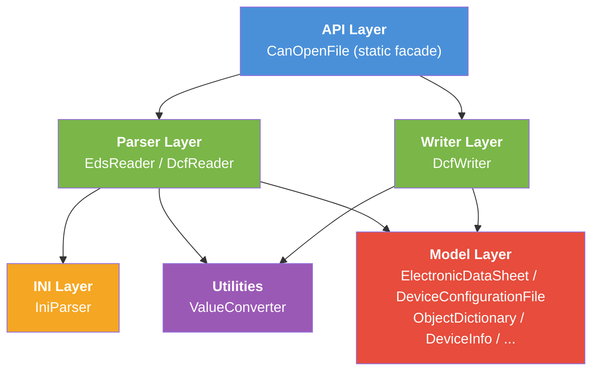

# 4. Solution Strategy

## 4.1 Technology Decisions

| Decision                       | Rationale                                                                        |
|--------------------------------|----------------------------------------------------------------------------------|
| **C# / .NET**                  | Primary target platform for industrial Windows applications in the CANopen space. |
| **netstandard2.0 + net10.0**   | Maximum compatibility (incl. .NET Framework) while gaining access to modern APIs. |
| **No external dependencies**   | Minimizes risk of version conflicts, simplifies deployment and auditing.         |
| **Static facade (`CanOpenFile`)** | Simple entry point that hides internal complexity.                            |
| **INI parser as foundation**   | EDS/DCF files are based on the INI format; a custom parser avoids external dependencies. |

## 4.2 Architecture Patterns and Style

### Layered Architecture

The library follows a clean **layered architecture**:



### Facade Pattern

`CanOpenFile` serves as the sole public entry point and encapsulates the coordination of internal components. Consumers do not need to instantiate parsers or writers directly.

### Pipeline Pattern

Processing follows a linear pipeline:

```
EDS/DCF file --> IniParser --> EdsReader/DcfReader --> Models --> DcfWriter --> DCF file
```

## 4.3 Key Design Decisions

| Decision                              | Motivation                                                               |
|---------------------------------------|--------------------------------------------------------------------------|
| **Separate EDS/DCF models**           | EDS (template) and DCF (configured instance) have different semantics. DCF extends EDS with `DeviceCommissioning` and `ParameterValue`. |
| **Round-trip fidelity**               | Unknown sections are preserved as `AdditionalSections` to avoid losing information during write-back. |
| **Culture-independent processing**    | Consistent use of `InvariantCulture` ensures files are processed identically on all systems. |
| **Static methods over instances**     | Since the library holds no state between calls, static methods are the natural choice. |
| **Extension methods for convenience** | `ObjectDictionaryExtensions` provide commonly needed access patterns without bloating the core model. |
