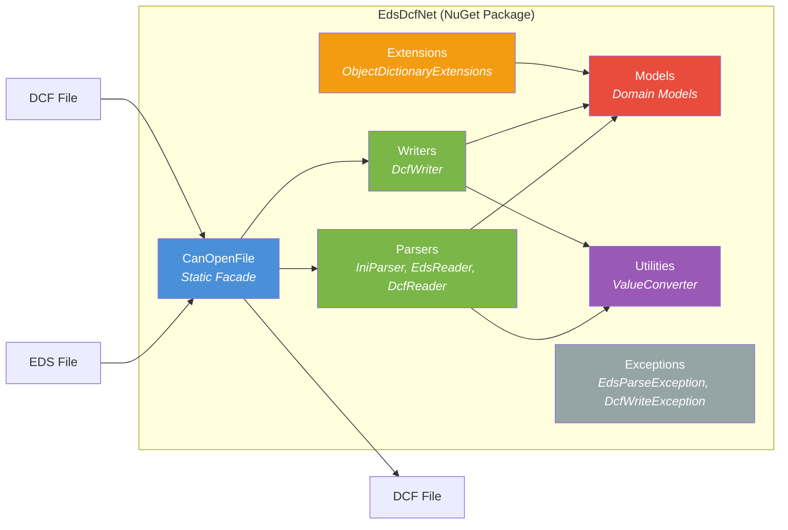
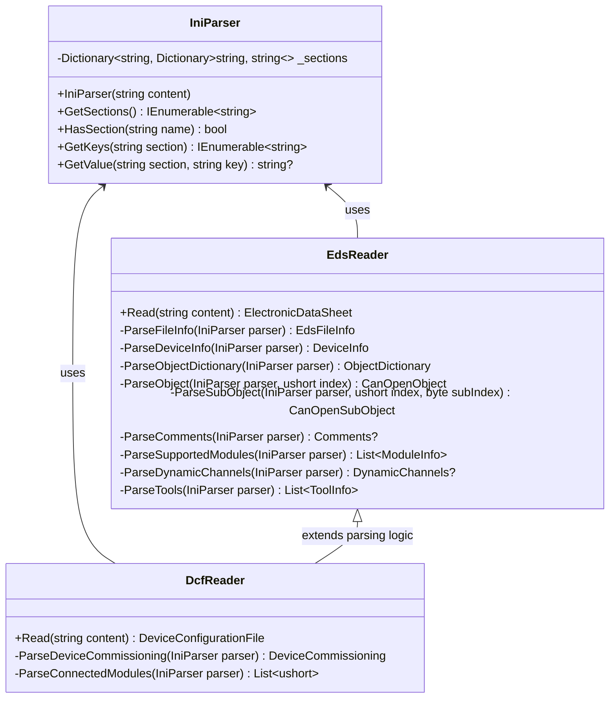
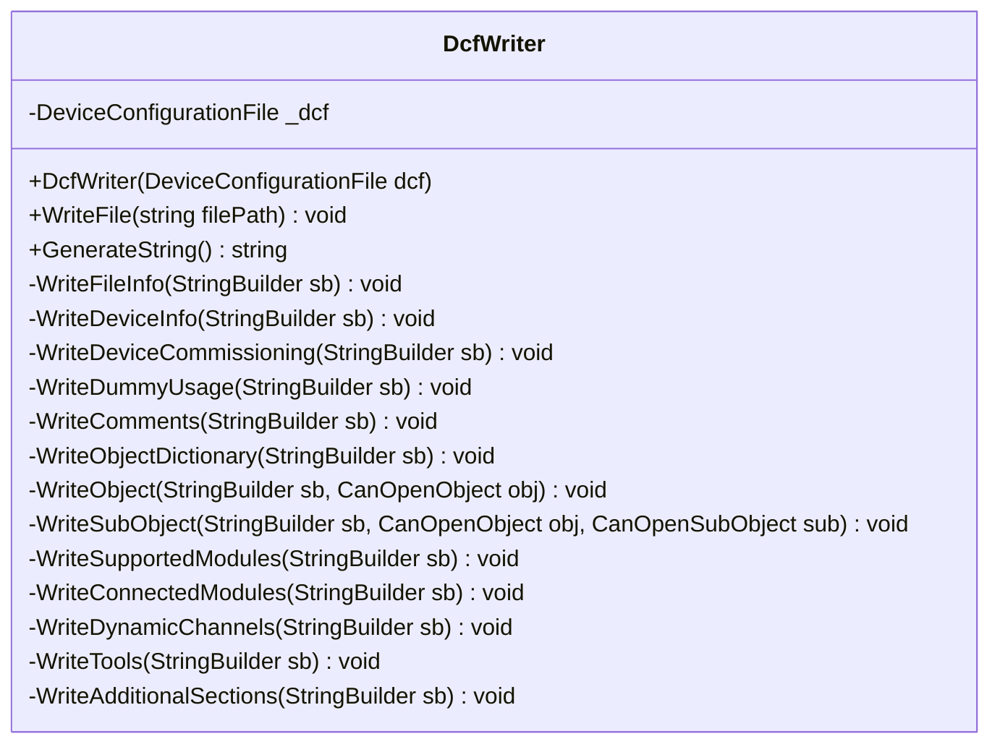
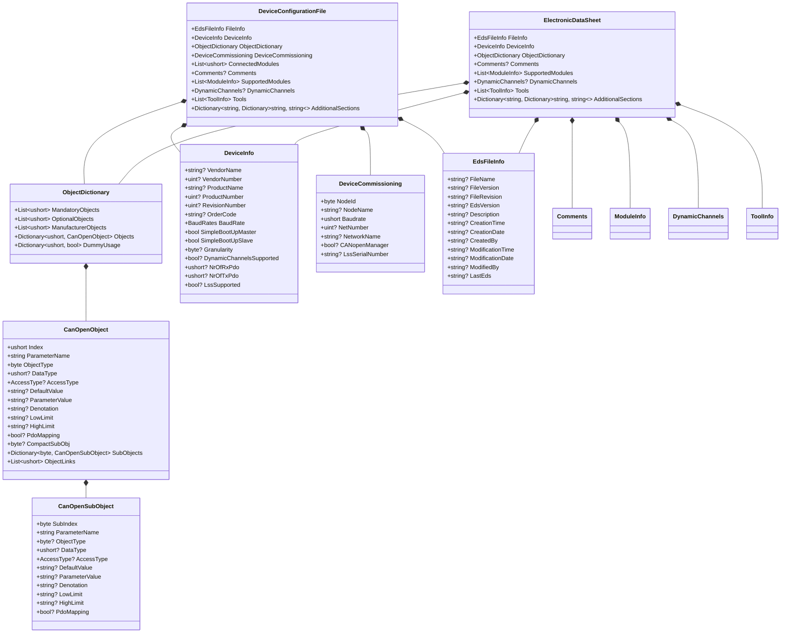
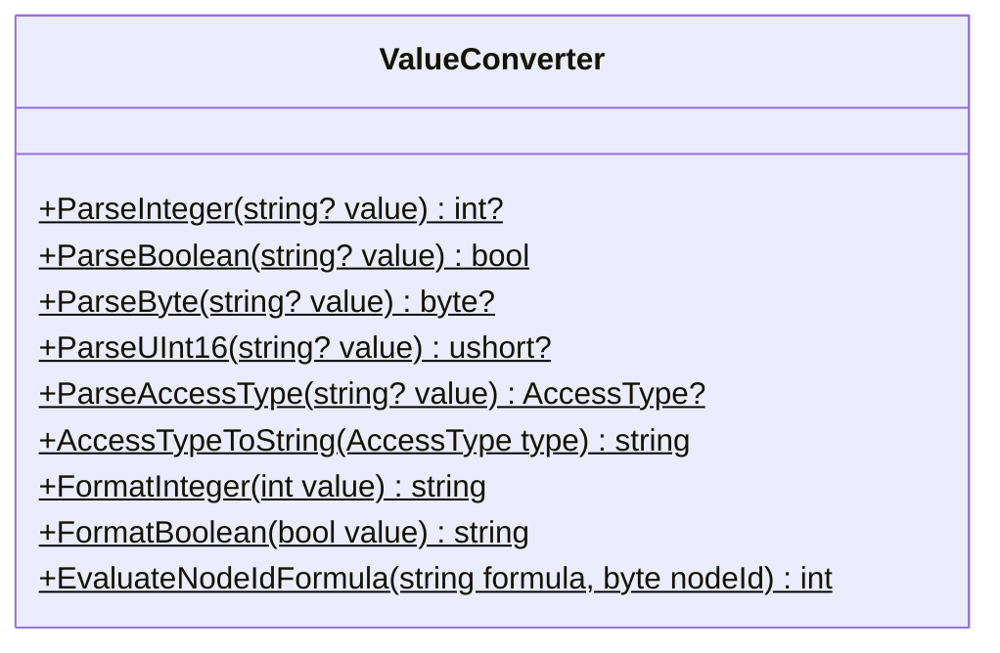
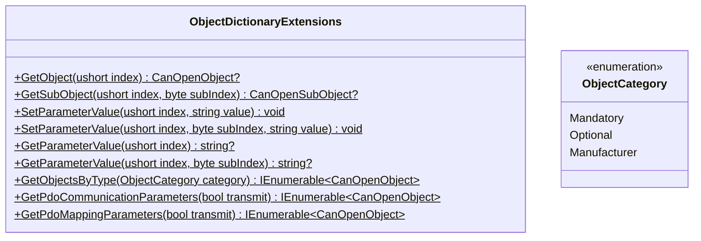
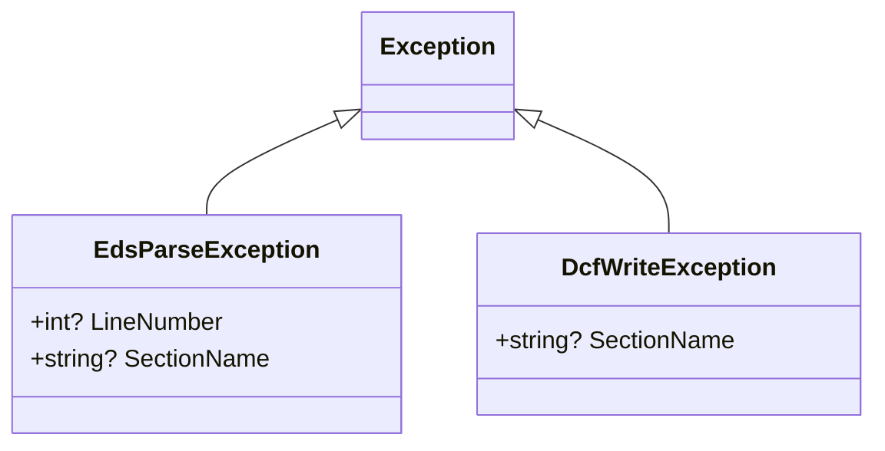

# 5. Building Block View

## 5.1 Level 1: Overall System

### Building Block Overview

| Building Block        | Responsibility                                                            |
|-----------------------|---------------------------------------------------------------------------|
| `CanOpenFile`         | Public API facade; coordinates parsers and writers                        |
| `Parsers/`            | Reading and interpreting EDS/DCF files                                    |
| `Writers/`            | Serializing models back to DCF file format                                |
| `Models/`             | Domain models representing the structure of EDS/DCF files                 |
| `Utilities/`          | Helper functions for type conversion (numbers, booleans, formulas)        |
| `Extensions/`         | Extension methods for convenient ObjectDictionary access                  |
| `Exceptions/`         | Specific exception types for parse and write errors                       |

## 5.2 Level 2: Detailed Building Blocks

### 5.2.1 Parsers

**IniParser** is the base component that transforms raw INI text into a searchable data structure (sections with key-value pairs). Lookups are **case-insensitive**.

**EdsReader** uses the IniParser to build a complete `ElectronicDataSheet` model. It processes all specified sections and preserves unknown sections in `AdditionalSections`.

**DcfReader** extends the EdsReader logic with DCF-specific sections (`DeviceCommissioning`, `ConnectedModules`) and fields (`ParameterValue`, `Denotation`).

### 5.2.2 Writers

**DcfWriter** serializes a `DeviceConfigurationFile` model back into the INI-based DCF format. Output can be written either to a file (ASCII encoding) or returned as a string.

### 5.2.3 Models

### 5.2.4 Utilities

**ValueConverter** is a static utility class that encapsulates all type-specific conversions:

- **Number formats**: Decimal (`123`), hexadecimal (`0x7B`), octal (`0173`)
- **Boolean values**: `"1"`, `"true"`, `"yes"` are interpreted as `true`
- **`$NODEID` formulas**: Expressions like `$NODEID+0x200` are evaluated at runtime
- **AccessType mapping**: String-to-enum conversion (`"rw"` -> `ReadWrite`)

### 5.2.5 Extensions

### 5.2.6 Exceptions

**EdsParseException** is thrown on parsing errors and optionally contains line number and section name for diagnostics.

**DcfWriteException** is thrown on errors during DCF generation.
