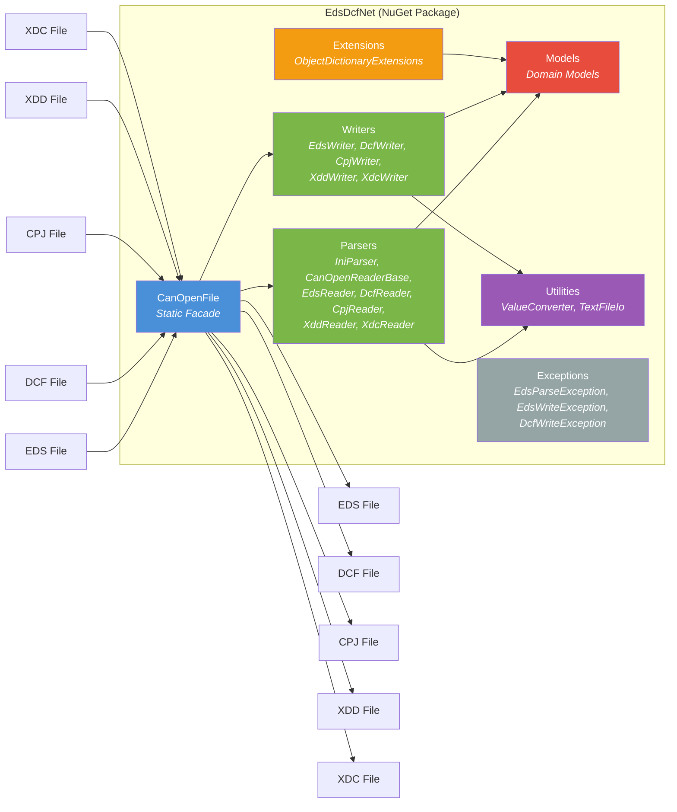
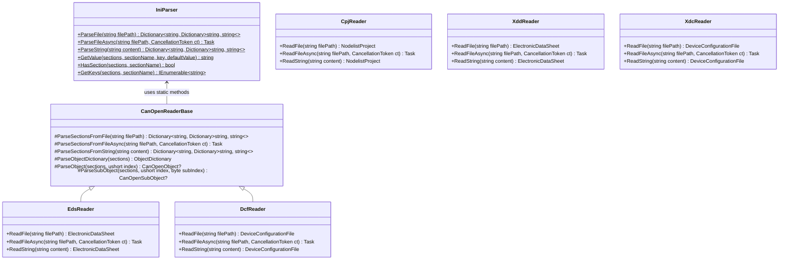
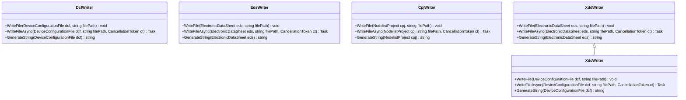
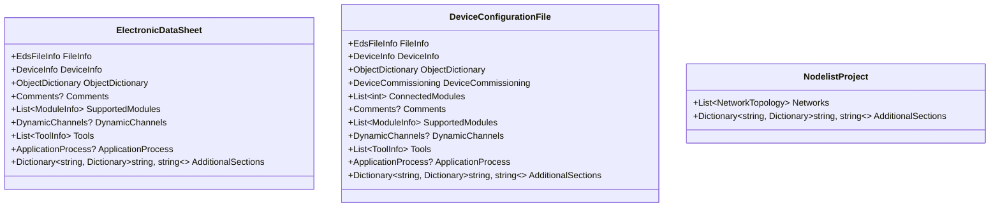
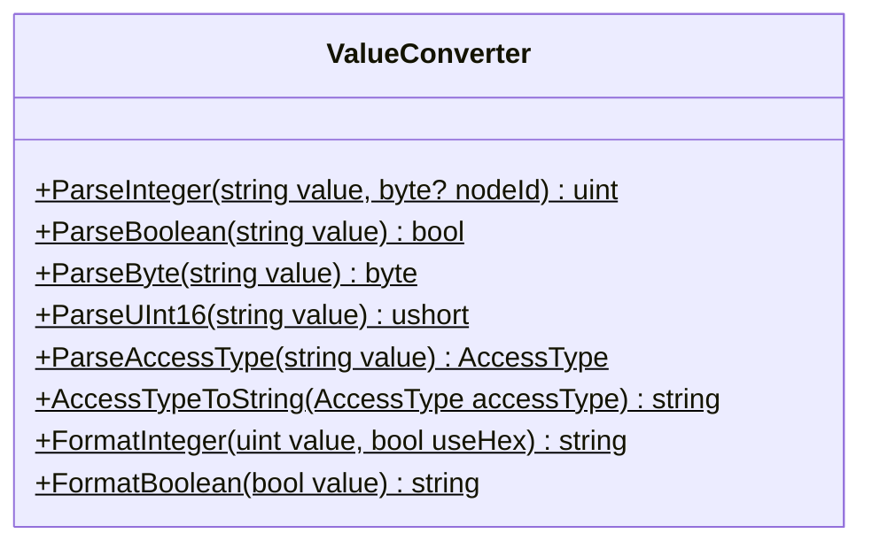
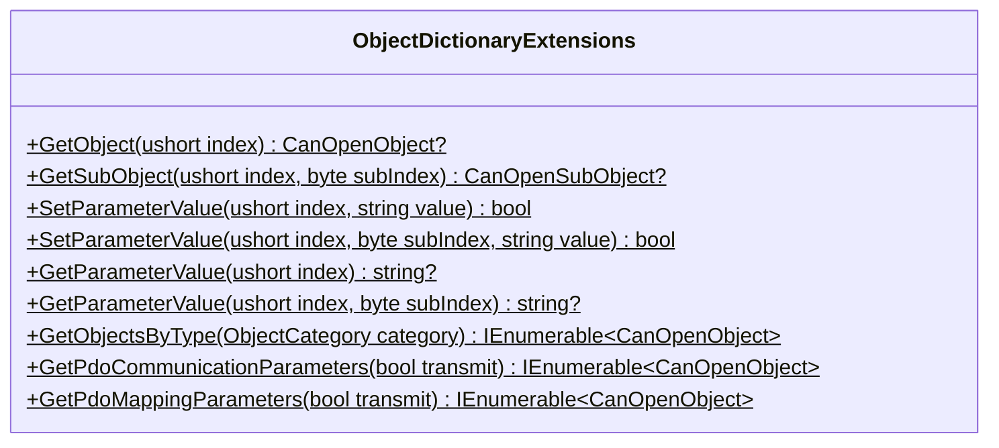
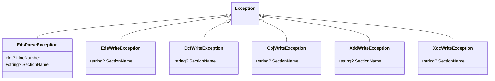

# 5. Building Block View

## 5.1 Level 1: Overall System

```mermaid
graph LR
    subgraph EdsDcfNet ["EdsDcfNet (NuGet Package)"]
        API["CanOpenFile<br/><i>Static Facade</i>"]
        Parsers["Parsers<br/><i>IniParser, CanOpenReaderBase,<br/>EdsReader, DcfReader, CpjReader,<br/>XddReader, XdcReader</i>"]
        Writers["Writers<br/><i>EdsWriter, DcfWriter, CpjWriter,<br/>XddWriter, XdcWriter</i>"]
        Models["Models<br/><i>Domain Models</i>"]
        Utilities["Utilities<br/><i>ValueConverter, TextFileIo</i>"]
        Extensions["Extensions<br/><i>ObjectDictionaryExtensions</i>"]
        Exceptions["Exceptions<br/><i>EdsParseException, EdsWriteException,<br/>DcfWriteException</i>"]
    end

    EDS["EDS File"] --> API
    DCF_In["DCF File"] --> API
    CPJ_In["CPJ File"] --> API
    XDD_In["XDD File"] --> API
    XDC_In["XDC File"] --> API
    API --> EDS_Out["EDS File"]
    API --> DCF_Out["DCF File"]
    API --> CPJ_Out["CPJ File"]
    API --> XDD_Out["XDD File"]
    API --> XDC_Out["XDC File"]
    API --> Parsers
    API --> Writers
    Parsers --> Models
    Writers --> Models
    Parsers --> Utilities
    Writers --> Utilities
    Extensions --> Models

    style API fill:#4A90D9,color:#fff
    style Parsers fill:#7AB648,color:#fff
    style Writers fill:#7AB648,color:#fff
    style Models fill:#E74C3C,color:#fff
    style Utilities fill:#9B59B6,color:#fff
    style Extensions fill:#F39C12,color:#fff
    style Exceptions fill:#95A5A6,color:#fff
```

### Building Block Overview

| Building Block        | Responsibility                                                                    |
|-----------------------|-----------------------------------------------------------------------------------|
| `CanOpenFile`         | Public API facade; coordinates parsers and writers                                |
| `Parsers/`            | Reading and interpreting EDS/DCF/CPJ (INI) and XDD/XDC (XML) files               |
| `Writers/`            | Serializing models back to EDS/DCF/CPJ (INI) and XDD/XDC (XML)                    |
| `Models/`             | Domain models representing the structure of CANopen description/configuration data |
| `Utilities/`          | Helper functions for type conversion and shared UTF-8 file I/O (`ValueConverter`, `TextFileIo`) |
| `Extensions/`         | Extension methods for convenient ObjectDictionary access                           |
| `Exceptions/`         | Specific exception types for parse and write errors                                |

## 5.2 Level 2: Detailed Building Blocks

### 5.2.1 Parsers

```mermaid
classDiagram
    class IniParser {
        +ParseFile(string filePath) Dictionary~string, Dictionary~string, string~~$
        +ParseFileAsync(string filePath, CancellationToken ct) Task$
        +ParseString(string content) Dictionary~string, Dictionary~string, string~~$
        +GetValue(sections, sectionName, key, defaultValue) string$
        +HasSection(sections, sectionName) bool$
        +GetKeys(sections, sectionName) IEnumerable~string~$
    }

    class CanOpenReaderBase {
        #ParseSectionsFromFile(string filePath) Dictionary~string, Dictionary~string, string~~
        #ParseSectionsFromFileAsync(string filePath, CancellationToken ct) Task
        #ParseSectionsFromString(string content) Dictionary~string, Dictionary~string, string~~
        #ParseObjectDictionary(sections) ObjectDictionary
        #ParseObject(sections, ushort index) CanOpenObject?
        #ParseSubObject(sections, ushort index, byte subIndex) CanOpenSubObject?
    }

    class EdsReader {
        +ReadFile(string filePath) ElectronicDataSheet
        +ReadFileAsync(string filePath, CancellationToken ct) Task
        +ReadString(string content) ElectronicDataSheet
    }

    class DcfReader {
        +ReadFile(string filePath) DeviceConfigurationFile
        +ReadFileAsync(string filePath, CancellationToken ct) Task
        +ReadString(string content) DeviceConfigurationFile
    }

    class CpjReader {
        +ReadFile(string filePath) NodelistProject
        +ReadFileAsync(string filePath, CancellationToken ct) Task
        +ReadString(string content) NodelistProject
    }

    class XddReader {
        +ReadFile(string filePath) ElectronicDataSheet
        +ReadFileAsync(string filePath, CancellationToken ct) Task
        +ReadString(string content) ElectronicDataSheet
    }

    class XdcReader {
        +ReadFile(string filePath) DeviceConfigurationFile
        +ReadFileAsync(string filePath, CancellationToken ct) Task
        +ReadString(string content) DeviceConfigurationFile
    }

    IniParser <-- CanOpenReaderBase : uses static methods
    CanOpenReaderBase <|-- EdsReader
    CanOpenReaderBase <|-- DcfReader
```

**IniParser** is a static component that transforms raw INI text into a sections dictionary (`Dictionary<string, Dictionary<string, string>>`). It uses a case-insensitive comparer for section/key lookups.

**CanOpenReaderBase** centralizes shared EDS/DCF parsing logic (object dictionary, modules, comments, dynamic channels) and is specialized by `EdsReader` and `DcfReader`.

**CpjReader** parses CiA 306-3 nodelist projects by reading `[Topology]`, `[Topology2]`, ... sections and mapping node entries (`NodeXPresent`, `NodeXName`, `NodeXDCFName`, `NodeXRefd`) to `NetworkTopology`/`NetworkNode`.

**XddReader** parses CiA 311 XML device descriptions into `ElectronicDataSheet`, including object dictionary, baud-rate capabilities, and optional typed `ApplicationProcess` (CiA 311 §6.4.5).

**XdcReader** parses CiA 311 XML device configurations into `DeviceConfigurationFile` and maps `actualValue`/`denotation` plus `deviceCommissioning`.

### 5.2.2 Writers

```mermaid
classDiagram
    class DcfWriter {
        +WriteFile(DeviceConfigurationFile dcf, string filePath) void
        +WriteFileAsync(DeviceConfigurationFile dcf, string filePath, CancellationToken ct) Task
        +GenerateString(DeviceConfigurationFile dcf) string
    }

    class EdsWriter {
        +WriteFile(ElectronicDataSheet eds, string filePath) void
        +WriteFileAsync(ElectronicDataSheet eds, string filePath, CancellationToken ct) Task
        +GenerateString(ElectronicDataSheet eds) string
    }

    class CpjWriter {
        +WriteFile(NodelistProject cpj, string filePath) void
        +WriteFileAsync(NodelistProject cpj, string filePath, CancellationToken ct) Task
        +GenerateString(NodelistProject cpj) string
    }

    class XddWriter {
        +WriteFile(ElectronicDataSheet eds, string filePath) void
        +WriteFileAsync(ElectronicDataSheet eds, string filePath, CancellationToken ct) Task
        +GenerateString(ElectronicDataSheet eds) string
    }

    class XdcWriter {
        +WriteFile(DeviceConfigurationFile dcf, string filePath) void
        +WriteFileAsync(DeviceConfigurationFile dcf, string filePath, CancellationToken ct) Task
        +GenerateString(DeviceConfigurationFile dcf) string
    }

    XddWriter <|-- XdcWriter
```

**EdsWriter** serializes `ElectronicDataSheet` to INI-based EDS and preserves unknown INI sections through `AdditionalSections` (except object-link sections for known objects, which are regenerated from typed model data).

**DcfWriter** serializes `DeviceConfigurationFile` to INI-based DCF and preserves unknown INI sections through `AdditionalSections` (except object-link sections for known objects, which are regenerated from typed model data).

**CpjWriter** serializes `NodelistProject` to INI-based CPJ, writing topology sections in deterministic order and formatting node count as hexadecimal.

**XddWriter** serializes `ElectronicDataSheet` into CiA 311 XML (`ISO15745ProfileContainer`) using UTF-8 without BOM.

**XdcWriter** extends `XddWriter` for configuration data and emits `actualValue`, `denotation`, and `deviceCommissioning` (NodeID must be `1..127` when present).

### 5.2.3 Models

```mermaid
classDiagram
    class ElectronicDataSheet {
        +EdsFileInfo FileInfo
        +DeviceInfo DeviceInfo
        +ObjectDictionary ObjectDictionary
        +Comments? Comments
        +List~ModuleInfo~ SupportedModules
        +DynamicChannels? DynamicChannels
        +List~ToolInfo~ Tools
        +ApplicationProcess? ApplicationProcess
        +Dictionary~string, Dictionary~string, string~~ AdditionalSections
    }

    class DeviceConfigurationFile {
        +EdsFileInfo FileInfo
        +DeviceInfo DeviceInfo
        +ObjectDictionary ObjectDictionary
        +DeviceCommissioning DeviceCommissioning
        +List~int~ ConnectedModules
        +Comments? Comments
        +List~ModuleInfo~ SupportedModules
        +DynamicChannels? DynamicChannels
        +List~ToolInfo~ Tools
        +ApplicationProcess? ApplicationProcess
        +Dictionary~string, Dictionary~string, string~~ AdditionalSections
    }

    class NodelistProject {
        +List~NetworkTopology~ Networks
        +Dictionary~string, Dictionary~string, string~~ AdditionalSections
    }
```

Core models are shared across INI and XML formats, enabling cross-format conversion scenarios without duplicate object graphs.

`ApplicationProcess` is populated exclusively when reading XDD/XDC files that contain an `ApplicationProcess` element (CiA 311 §6.4.5). It is `null` for EDS/DCF sources. The typed object graph covers all sub-constructs defined by the specification:

| Class | CiA 311 element | Description |
|---|---|---|
| `ApplicationProcess` | `ApplicationProcess` | Root container with data types, function types, templates, parameters, and parameter groups |
| `ApDataTypeList` | `dataTypeList` | Complex type definitions (arrays, structs, enums, derived types) |
| `ApFunctionType` | `functionType` | Device function description with optional nested instances |
| `ApFunctionInstanceList` | `functionInstanceList` | Function instances at ApplicationProcess level |
| `ApTemplateList` | `templateList` | Parameter and allowed-values templates |
| `ApParameter` | `parameter` | Individual parameter with data type, access, labels, allowed values, and default/actual values |
| `ApParameterGroup` | `parameterGroup` | HMI classification hierarchy for parameters |
| `ApLabelGroup` / `ApLabel` / `ApDescription` | `label` / `description` | Localised display names and descriptions (IETF BCP 47 language tags) |
| `ApTextRef` | `labelRef` / `descriptionRef` | References into an external dictionary resource |

### 5.2.4 Utilities

```mermaid
classDiagram
    class ValueConverter {
        +ParseInteger(string value, byte? nodeId) uint$
        +ParseBoolean(string value) bool$
        +ParseByte(string value) byte$
        +ParseUInt16(string value) ushort$
        +ParseAccessType(string value) AccessType$
        +AccessTypeToString(AccessType accessType) string$
        +FormatInteger(uint value, bool useHex) string$
        +FormatBoolean(bool value) string$
    }
```

`ValueConverter` encapsulates number parsing (decimal/hex/octal), `$NODEID` formula evaluation, and AccessType conversions.
`TextFileIo` centralizes asynchronous UTF-8 file access with cancellation support and consistent no-BOM output handling.

### 5.2.5 Extensions

```mermaid
classDiagram
    class ObjectDictionaryExtensions {
        +GetObject(ushort index) CanOpenObject?$
        +GetSubObject(ushort index, byte subIndex) CanOpenSubObject?$
        +SetParameterValue(ushort index, string value) bool$
        +SetParameterValue(ushort index, byte subIndex, string value) bool$
        +GetParameterValue(ushort index) string?$
        +GetParameterValue(ushort index, byte subIndex) string?$
        +GetObjectsByType(ObjectCategory category) IEnumerable~CanOpenObject~$
        +GetPdoCommunicationParameters(bool transmit) IEnumerable~CanOpenObject~$
        +GetPdoMappingParameters(bool transmit) IEnumerable~CanOpenObject~$
    }
```

### 5.2.6 Exceptions

```mermaid
classDiagram
    Exception <|-- EdsParseException
    Exception <|-- EdsWriteException
    Exception <|-- DcfWriteException
    Exception <|-- CpjWriteException
    Exception <|-- XddWriteException
    Exception <|-- XdcWriteException

    class EdsParseException {
        +int? LineNumber
        +string? SectionName
    }

    class EdsWriteException {
        +string? SectionName
    }

    class DcfWriteException {
        +string? SectionName
    }

    class CpjWriteException {
        +string? SectionName
    }

    class XddWriteException {
        +string? SectionName
    }

    class XdcWriteException {
        +string? SectionName
    }
```

`EdsParseException` is used for EDS/DCF/XDD/XDC parsing errors.  
`EdsWriteException` is used for EDS write/generation failures.  
`DcfWriteException` is used for DCF write/generation failures.  
`CpjWriteException` is used for CPJ write/generation failures.  
`XddWriteException` is used for XDD write/generation failures.  
`XdcWriteException` is used for XDC write/generation failures.
