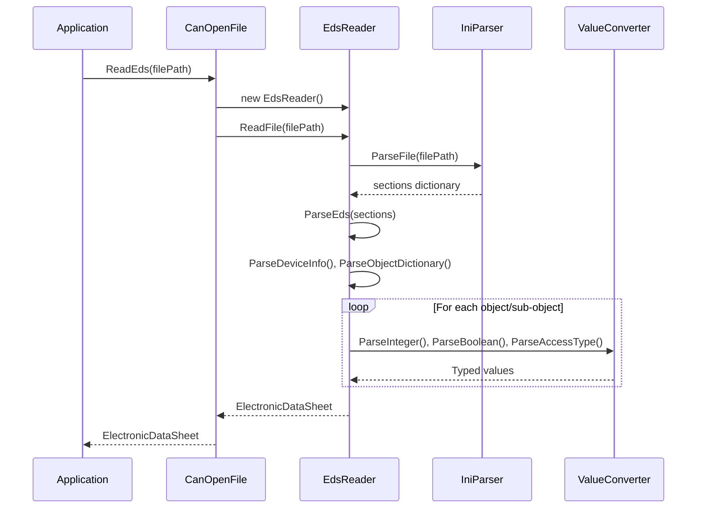
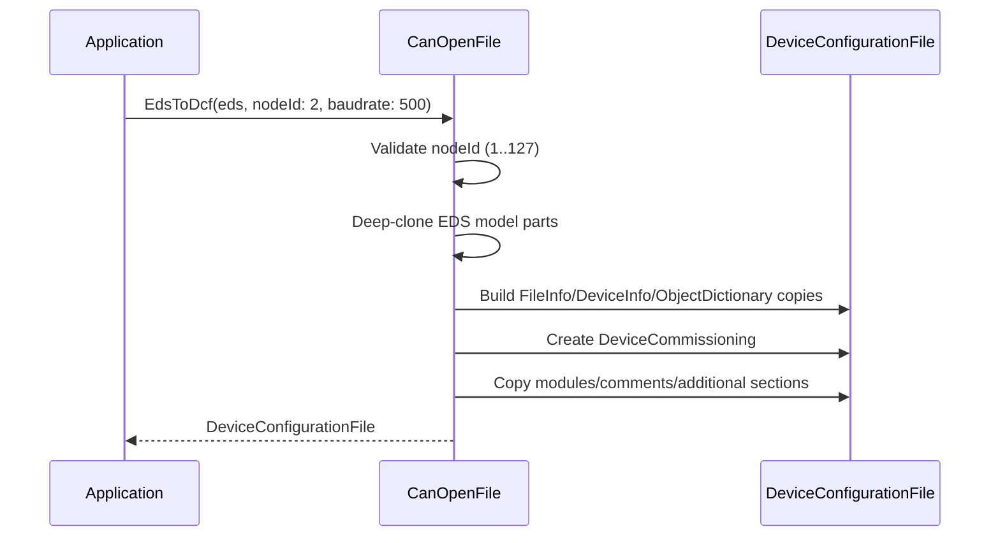
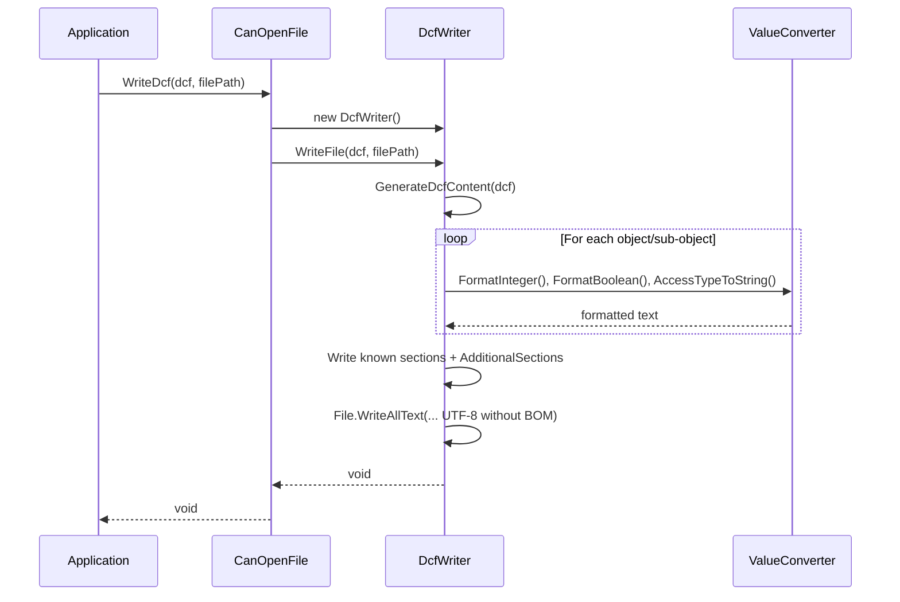
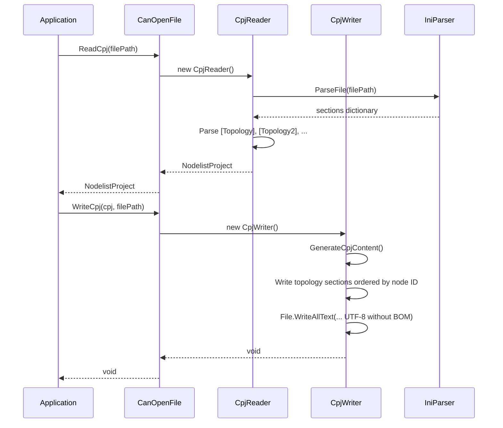
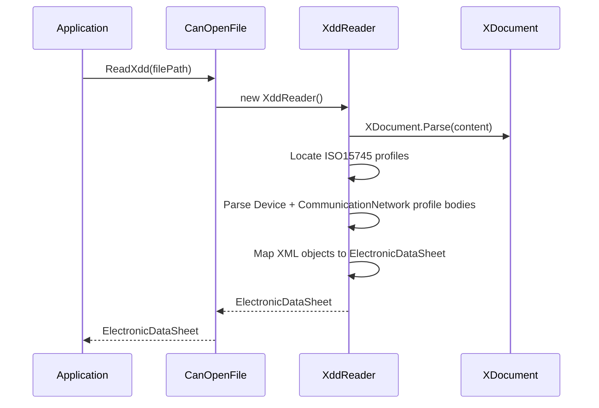
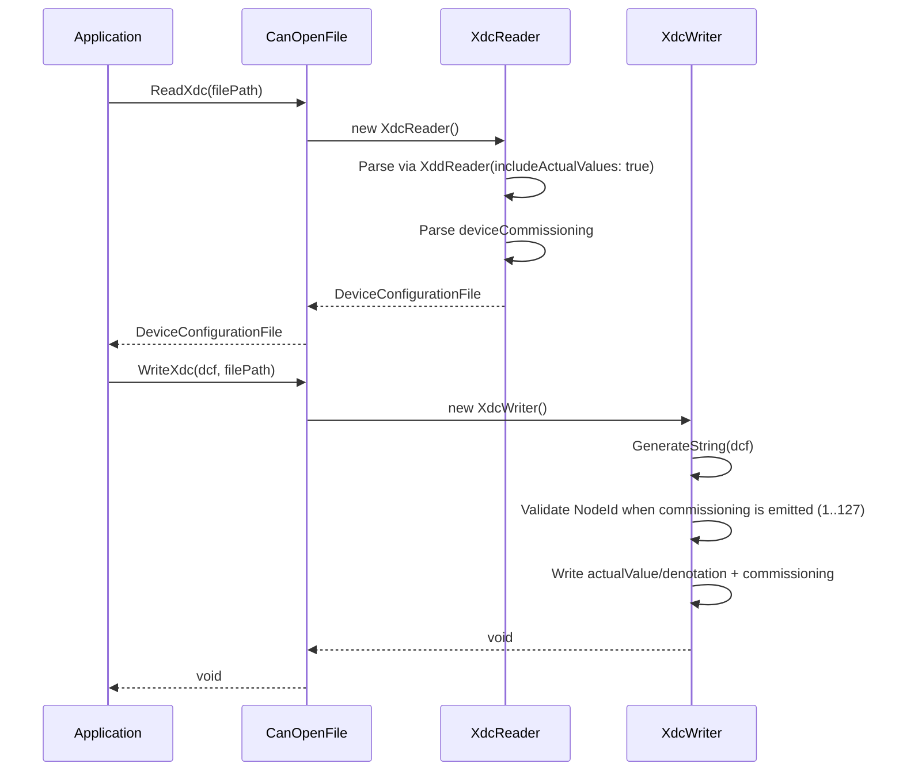
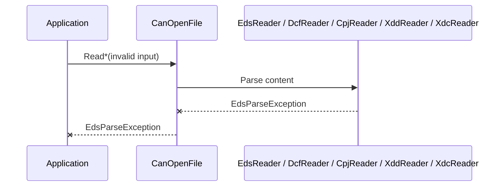

# 6. Runtime View

## 6.1 Reading an EDS File

```mermaid
sequenceDiagram
    participant App as Application
    participant CF as CanOpenFile
    participant ER as EdsReader
    participant IP as IniParser
    participant VC as ValueConverter

    App->>CF: ReadEds(filePath)
    CF->>ER: new EdsReader()
    CF->>ER: ReadFile(filePath)
    ER->>IP: ParseFile(filePath)
    IP-->>ER: sections dictionary
    ER->>ER: ParseEds(sections)
    ER->>ER: ParseDeviceInfo(), ParseObjectDictionary()

    loop For each object/sub-object
        ER->>VC: ParseInteger(), ParseBoolean(), ParseAccessType()
        VC-->>ER: Typed values
    end

    ER-->>CF: ElectronicDataSheet
    CF-->>App: ElectronicDataSheet
```

## 6.2 Converting EDS to DCF

```mermaid
sequenceDiagram
    participant App as Application
    participant CF as CanOpenFile
    participant Model as DeviceConfigurationFile

    App->>CF: EdsToDcf(eds, nodeId: 2, baudrate: 500)
    CF->>CF: Validate nodeId (1..127)
    CF->>CF: Deep-clone EDS model parts
    CF->>Model: Build FileInfo/DeviceInfo/ObjectDictionary copies
    CF->>Model: Create DeviceCommissioning
    CF->>Model: Copy modules/comments/additional sections
    CF-->>App: DeviceConfigurationFile
```

## 6.3 Writing a DCF File

```mermaid
sequenceDiagram
    participant App as Application
    participant CF as CanOpenFile
    participant DW as DcfWriter
    participant VC as ValueConverter

    App->>CF: WriteDcf(dcf, filePath)
    CF->>DW: new DcfWriter()
    CF->>DW: WriteFile(dcf, filePath)
    DW->>DW: GenerateDcfContent(dcf)

    loop For each object/sub-object
        DW->>VC: FormatInteger(), FormatBoolean(), AccessTypeToString()
        VC-->>DW: formatted text
    end

    DW->>DW: Write known sections + AdditionalSections
    DW->>DW: File.WriteAllText(... UTF-8 without BOM)
    DW-->>CF: void
    CF-->>App: void
```

## 6.4 Reading and Writing CPJ Files

```mermaid
sequenceDiagram
    participant App as Application
    participant CF as CanOpenFile
    participant CR as CpjReader
    participant CW as CpjWriter
    participant IP as IniParser

    App->>CF: ReadCpj(filePath)
    CF->>CR: new CpjReader()
    CR->>IP: ParseFile(filePath)
    IP-->>CR: sections dictionary
    CR->>CR: Parse [Topology], [Topology2], ...
    CR-->>CF: NodelistProject
    CF-->>App: NodelistProject

    App->>CF: WriteCpj(cpj, filePath)
    CF->>CW: new CpjWriter()
    CW->>CW: GenerateCpjContent()
    CW->>CW: Write topology sections ordered by node ID
    CW->>CW: File.WriteAllText(... UTF-8 without BOM)
    CW-->>CF: void
    CF-->>App: void
```

## 6.5 Reading an XDD File

```mermaid
sequenceDiagram
    participant App as Application
    participant CF as CanOpenFile
    participant XR as XddReader
    participant XML as XDocument

    App->>CF: ReadXdd(filePath)
    CF->>XR: new XddReader()
    XR->>XML: XDocument.Parse(content)
    XR->>XR: Locate ISO15745 profiles
    XR->>XR: Parse Device + CommunicationNetwork profile bodies
    XR->>XR: Map XML objects to ElectronicDataSheet
    XR-->>CF: ElectronicDataSheet
    CF-->>App: ElectronicDataSheet
```

## 6.6 Reading and Writing XDC Files

```mermaid
sequenceDiagram
    participant App as Application
    participant CF as CanOpenFile
    participant XR as XdcReader
    participant XW as XdcWriter

    App->>CF: ReadXdc(filePath)
    CF->>XR: new XdcReader()
    XR->>XR: Parse via XddReader(includeActualValues: true)
    XR->>XR: Parse deviceCommissioning
    XR-->>CF: DeviceConfigurationFile
    CF-->>App: DeviceConfigurationFile

    App->>CF: WriteXdc(dcf, filePath)
    CF->>XW: new XdcWriter()
    XW->>XW: GenerateString(dcf)
    XW->>XW: Validate NodeId when commissioning is emitted (1..127)
    XW->>XW: Write actualValue/denotation + commissioning
    XW-->>CF: void
    CF-->>App: void
```

## 6.7 Parse Error Handling

```mermaid
sequenceDiagram
    participant App as Application
    participant CF as CanOpenFile
    participant Reader as EdsReader / DcfReader / CpjReader / XddReader / XdcReader

    App->>CF: Read*(invalid input)
    CF->>Reader: Parse content
    Reader--xCF: EdsParseException
    CF--xApp: EdsParseException
```

Errors include contextual metadata where available (e.g., section name, line number for INI parsing cases).
