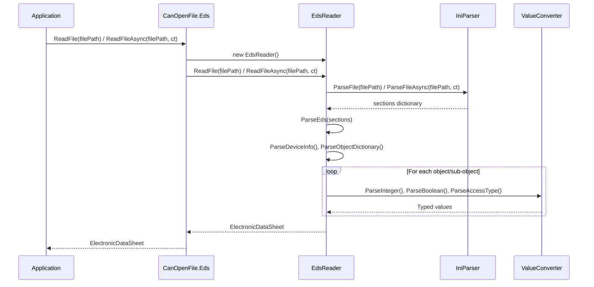
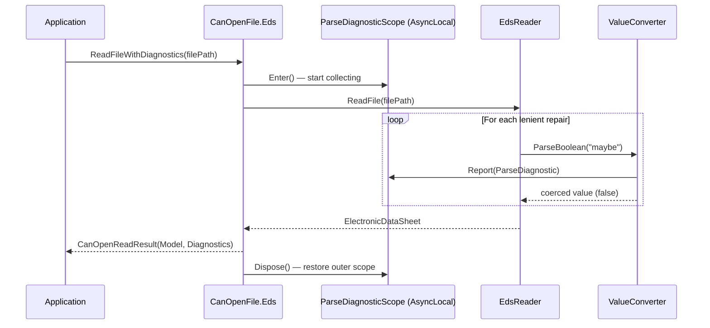
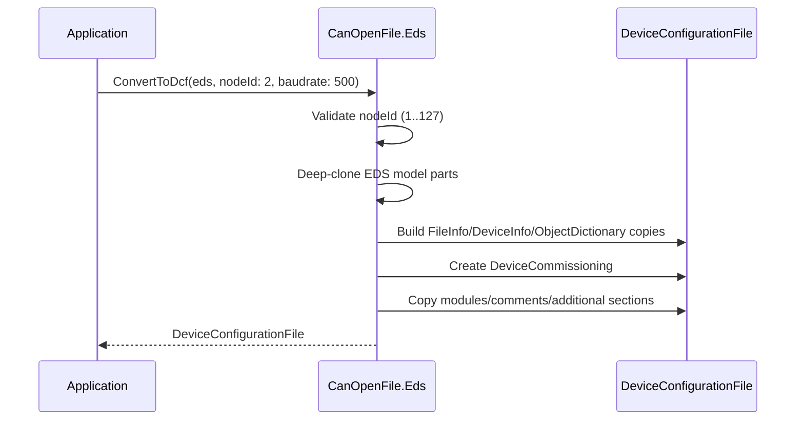
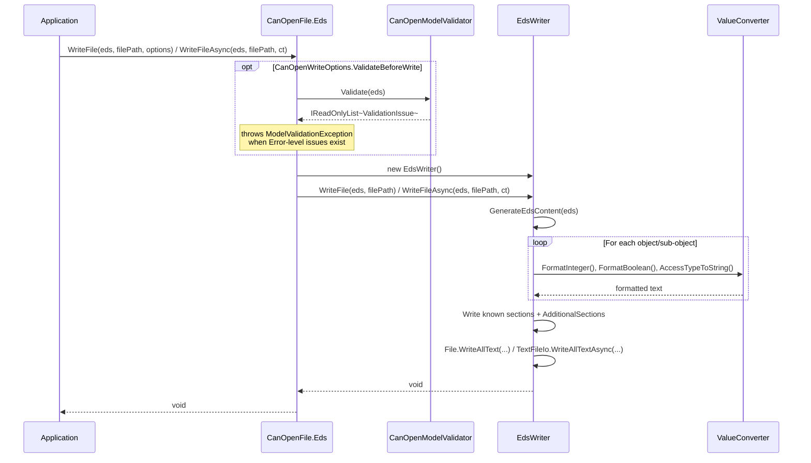
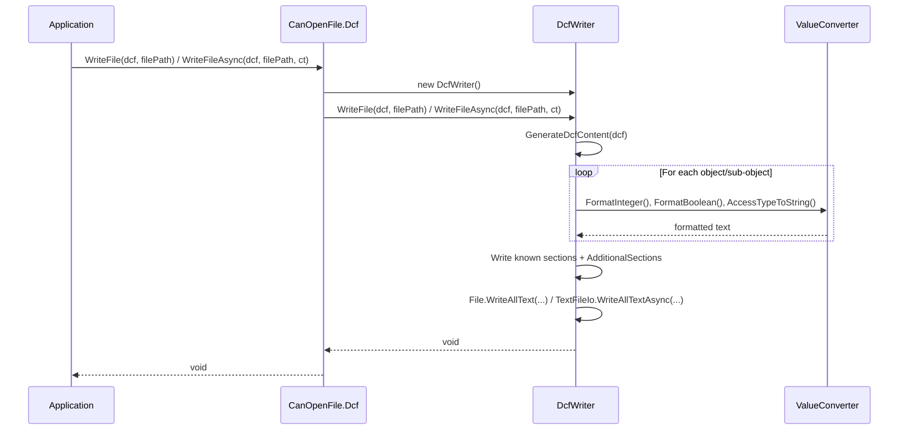
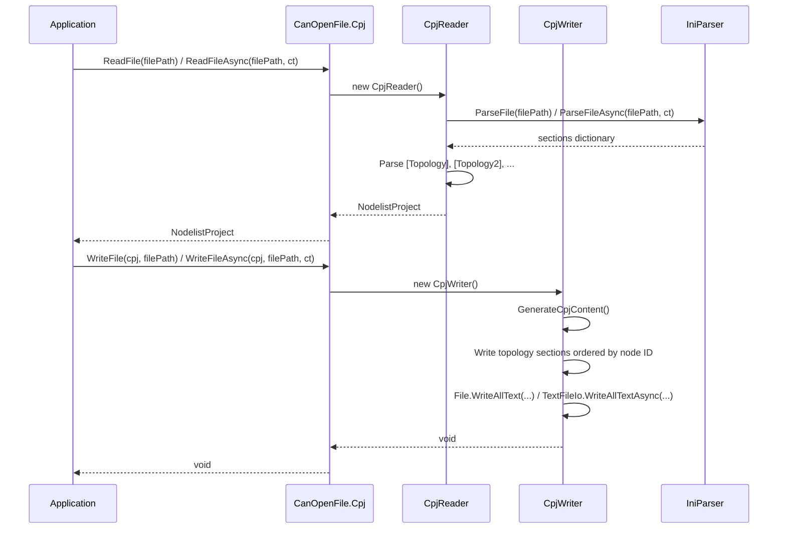
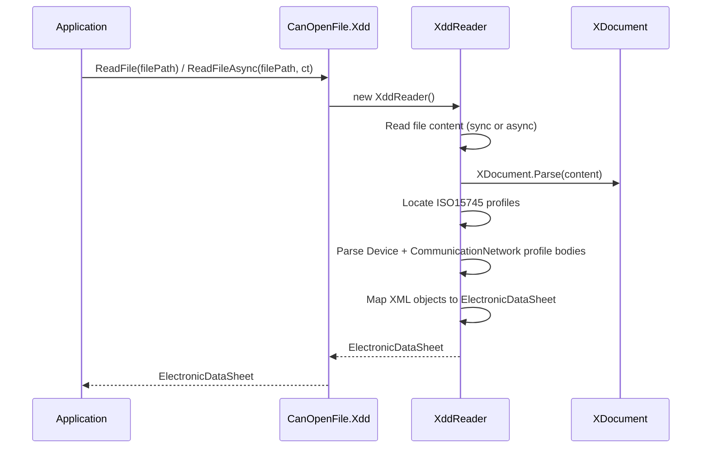
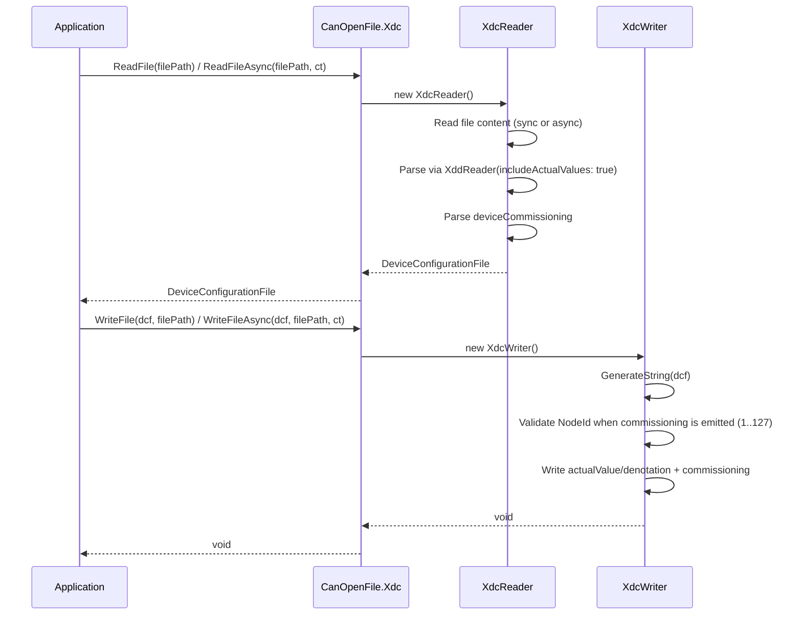
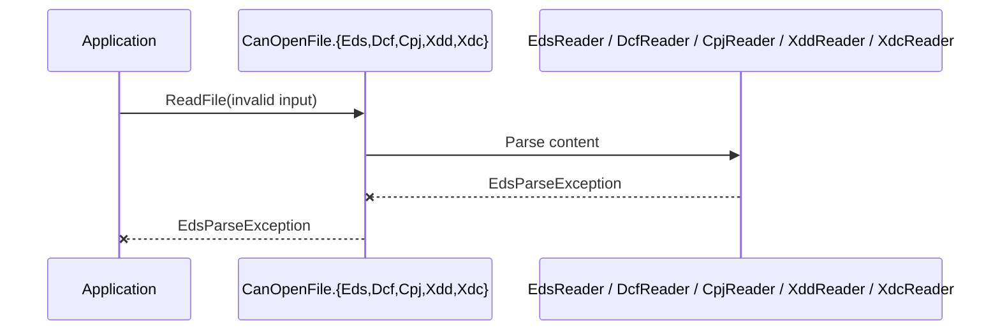

# 6. Runtime View

All read/write flows are available in synchronous and asynchronous variants.
The sequence diagrams show the synchronous path and annotate the async equivalents
(`Read*Async` / `Write*Async`) where file I/O is involved. Calls go through the
canonical format entry points (`CanOpenFile.Eds`, `.Dcf`, `.Cpj`, `.Xdd`, `.Xdc`);
the legacy static facade overloads delegate to them.

## 6.1 Reading an EDS File

```mermaid
sequenceDiagram
    participant App as Application
    participant CF as CanOpenFile.Eds
    participant ER as EdsReader
    participant IP as IniParser
    participant VC as ValueConverter

    App->>CF: ReadFile(filePath) / ReadFileAsync(filePath, ct)
    CF->>ER: new EdsReader()
    CF->>ER: ReadFile(filePath) / ReadFileAsync(filePath, ct)
    ER->>IP: ParseFile(filePath) / ParseFileAsync(filePath, ct)
    IP-->>ER: sections dictionary
    ER->>ER: ParseEds(sections)
    ER->>ER: ParseDeviceInfo(), ParseObjectDictionary()

    loop For each object/sub-object
        ER->>VC: ParseInteger(), ParseBoolean(), ParseAccessType()
        VC-->>ER: Typed values
    end

    ER-->>CF: ElectronicDataSheet
    CF-->>App: ElectronicDataSheet
```

## 6.2 Reading with Parse Diagnostics

`Read*WithDiagnostics` adds a third path between lenient coercion and
`StrictParsing` failure: the model is returned together with every repair as a
`ParseDiagnostic`. The collector is an `AsyncLocal` sink scoped to the call, so
concurrent reads do not interfere.

```mermaid
sequenceDiagram
    participant App as Application
    participant CF as CanOpenFile.Eds
    participant Scope as ParseDiagnosticScope (AsyncLocal)
    participant ER as EdsReader
    participant VC as ValueConverter

    App->>CF: ReadFileWithDiagnostics(filePath)
    CF->>Scope: Enter() — start collecting
    CF->>ER: ReadFile(filePath)

    loop For each lenient repair
        ER->>VC: ParseBoolean("maybe")
        VC->>Scope: Report(ParseDiagnostic)
        VC-->>ER: coerced value (false)
    end

    ER-->>CF: ElectronicDataSheet
    CF-->>App: CanOpenReadResult(Model, Diagnostics)
    CF->>Scope: Dispose() — restore outer scope
```

## 6.3 Converting EDS to DCF

```mermaid
sequenceDiagram
    participant App as Application
    participant CF as CanOpenFile.Eds
    participant Model as DeviceConfigurationFile

    App->>CF: ConvertToDcf(eds, nodeId: 2, baudrate: 500)
    CF->>CF: Validate nodeId (1..127)
    CF->>CF: Deep-clone EDS model parts
    CF->>Model: Build FileInfo/DeviceInfo/ObjectDictionary copies
    CF->>Model: Create DeviceCommissioning
    CF->>Model: Copy modules/comments/additional sections
    CF-->>App: DeviceConfigurationFile
```

## 6.4 Writing an EDS File

```mermaid
sequenceDiagram
    participant App as Application
    participant CF as CanOpenFile.Eds
    participant V as CanOpenModelValidator
    participant EW as EdsWriter
    participant VC as ValueConverter

    App->>CF: WriteFile(eds, filePath, options) / WriteFileAsync(eds, filePath, ct)
    opt CanOpenWriteOptions.ValidateBeforeWrite
        CF->>V: Validate(eds)
        V-->>CF: IReadOnlyList~ValidationIssue~
        note over CF: throws ModelValidationException<br/>when Error-level issues exist
    end
    CF->>EW: new EdsWriter()
    CF->>EW: WriteFile(eds, filePath) / WriteFileAsync(eds, filePath, ct)
    EW->>EW: GenerateEdsContent(eds)

    loop For each object/sub-object
        EW->>VC: FormatInteger(), FormatBoolean(), AccessTypeToString()
        VC-->>EW: formatted text
    end

    EW->>EW: Write known sections + AdditionalSections
    EW->>EW: File.WriteAllText(...) / TextFileIo.WriteAllTextAsync(...)
    EW-->>CF: void
    CF-->>App: void
```

## 6.5 Writing a DCF File

```mermaid
sequenceDiagram
    participant App as Application
    participant CF as CanOpenFile.Dcf
    participant DW as DcfWriter
    participant VC as ValueConverter

    App->>CF: WriteFile(dcf, filePath) / WriteFileAsync(dcf, filePath, ct)
    CF->>DW: new DcfWriter()
    CF->>DW: WriteFile(dcf, filePath) / WriteFileAsync(dcf, filePath, ct)
    DW->>DW: GenerateDcfContent(dcf)

    loop For each object/sub-object
        DW->>VC: FormatInteger(), FormatBoolean(), AccessTypeToString()
        VC-->>DW: formatted text
    end

    DW->>DW: Write known sections + AdditionalSections
    DW->>DW: File.WriteAllText(...) / TextFileIo.WriteAllTextAsync(...)
    DW-->>CF: void
    CF-->>App: void
```

## 6.6 Reading and Writing CPJ Files

```mermaid
sequenceDiagram
    participant App as Application
    participant CF as CanOpenFile.Cpj
    participant CR as CpjReader
    participant CW as CpjWriter
    participant IP as IniParser

    App->>CF: ReadFile(filePath) / ReadFileAsync(filePath, ct)
    CF->>CR: new CpjReader()
    CR->>IP: ParseFile(filePath) / ParseFileAsync(filePath, ct)
    IP-->>CR: sections dictionary
    CR->>CR: Parse [Topology], [Topology2], ...
    CR-->>CF: NodelistProject
    CF-->>App: NodelistProject

    App->>CF: WriteFile(cpj, filePath) / WriteFileAsync(cpj, filePath, ct)
    CF->>CW: new CpjWriter()
    CW->>CW: GenerateCpjContent()
    CW->>CW: Write topology sections ordered by node ID
    CW->>CW: File.WriteAllText(...) / TextFileIo.WriteAllTextAsync(...)
    CW-->>CF: void
    CF-->>App: void
```

## 6.7 Reading an XDD File

```mermaid
sequenceDiagram
    participant App as Application
    participant CF as CanOpenFile.Xdd
    participant XR as XddReader
    participant XML as XDocument

    App->>CF: ReadFile(filePath) / ReadFileAsync(filePath, ct)
    CF->>XR: new XddReader()
    XR->>XR: Read file content (sync or async)
    XR->>XML: XDocument.Parse(content)
    XR->>XR: Locate ISO15745 profiles
    XR->>XR: Parse Device + CommunicationNetwork profile bodies
    XR->>XR: Map XML objects to ElectronicDataSheet
    XR-->>CF: ElectronicDataSheet
    CF-->>App: ElectronicDataSheet
```

## 6.8 Reading and Writing XDC Files

```mermaid
sequenceDiagram
    participant App as Application
    participant CF as CanOpenFile.Xdc
    participant XR as XdcReader
    participant XW as XdcWriter

    App->>CF: ReadFile(filePath) / ReadFileAsync(filePath, ct)
    CF->>XR: new XdcReader()
    XR->>XR: Read file content (sync or async)
    XR->>XR: Parse via XddReader(includeActualValues: true)
    XR->>XR: Parse deviceCommissioning
    XR-->>CF: DeviceConfigurationFile
    CF-->>App: DeviceConfigurationFile

    App->>CF: WriteFile(dcf, filePath) / WriteFileAsync(dcf, filePath, ct)
    CF->>XW: new XdcWriter()
    XW->>XW: GenerateString(dcf)
    XW->>XW: Validate NodeId when commissioning is emitted (1..127)
    XW->>XW: Write actualValue/denotation + commissioning
    XW-->>CF: void
    CF-->>App: void
```

## 6.9 Parse Error Handling

```mermaid
sequenceDiagram
    participant App as Application
    participant CF as CanOpenFile.{Eds,Dcf,Cpj,Xdd,Xdc}
    participant Reader as EdsReader / DcfReader / CpjReader / XddReader / XdcReader

    App->>CF: ReadFile(invalid input)
    CF->>Reader: Parse content
    Reader--xCF: EdsParseException
    CF--xApp: EdsParseException
```

Errors include contextual metadata where available (e.g., section name, line number
for INI parsing cases). When the failure corresponds to an instrumented lenient-mode
repair, the exception also carries the stable diagnostic `Code` (see §8.1).
