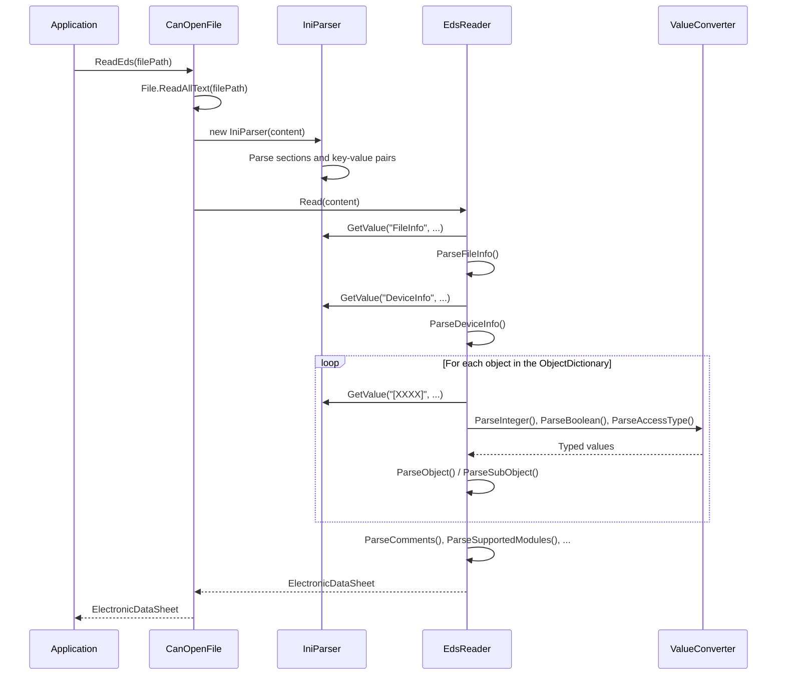
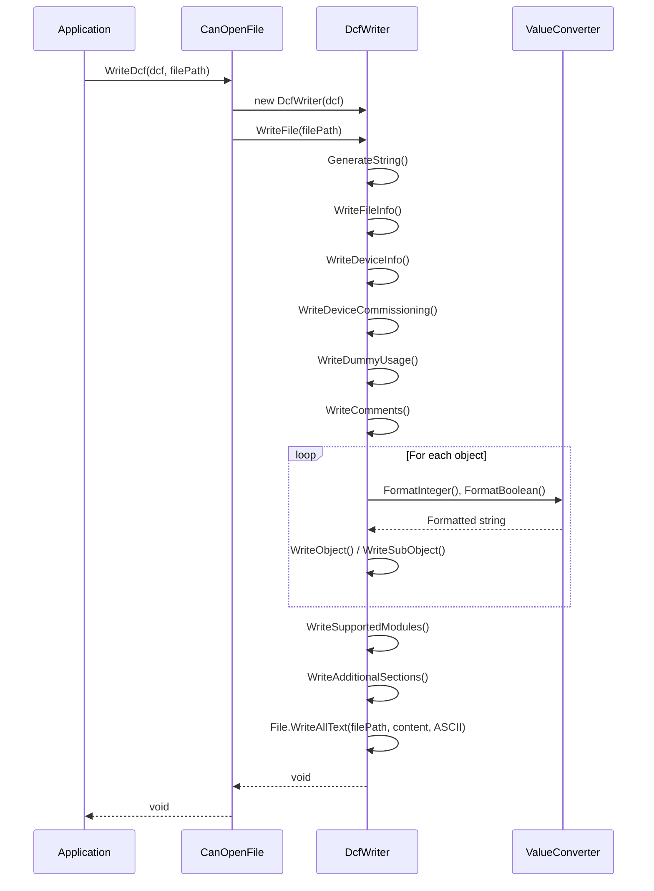

# 6. Runtime View

## 6.1 Reading an EDS File

The following sequence diagram shows the flow when reading an EDS file:

## 6.2 Converting EDS to DCF

## 6.3 Writing a DCF File

## 6.4 DCF Round-Trip (Read and Write Back)

## 6.5 Error Handling During Parsing

