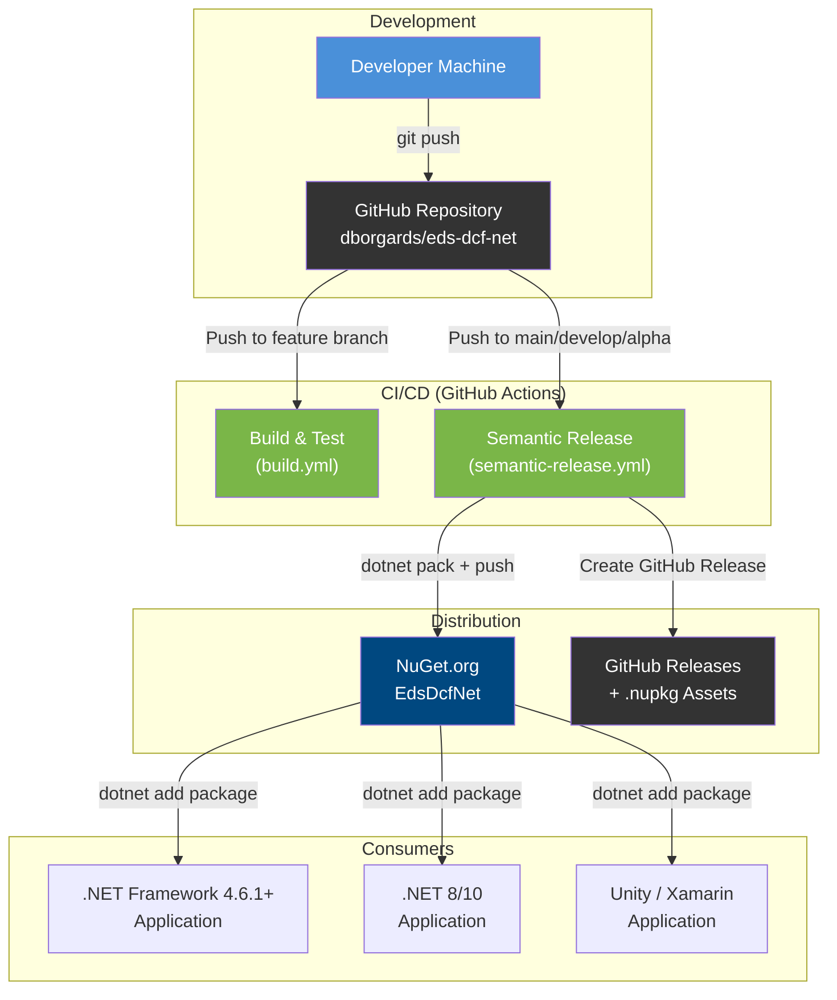

# 7. Deployment View

## 7.1 Infrastructure

EdsDcfNet is a pure library without its own runtime infrastructure. Distribution is via NuGet package.



## 7.2 NuGet Package Structure

The NuGet package contains two target frameworks:

```
EdsDcfNet.1.3.0.nupkg
├── lib/
│   ├── netstandard2.0/
│   │   ├── EdsDcfNet.dll
│   │   └── EdsDcfNet.xml        (XML documentation)
│   └── net10.0/
│       ├── EdsDcfNet.dll
│       └── EdsDcfNet.xml
├── README.md
└── EdsDcfNet.nuspec

EdsDcfNet.1.3.0.snupkg            (Symbol package for Source Link)
```

## 7.3 CI/CD Pipeline

```mermaid
flowchart LR
    subgraph Trigger ["Trigger"]
        Push["Push to main, develop, alpha"]
    end

    subgraph Pipeline ["GitHub Actions: Semantic Release"]
        Checkout["Checkout"]
        Setup[".NET + Node.js Setup"]
        Restore["dotnet restore"]
        BuildStep["dotnet build"]
        Test["dotnet test<br/>+ Codecov Upload"]
        SR["semantic-release"]
    end

    subgraph SR_Steps ["semantic-release Steps"]
        Analyze["commit-analyzer<br/><i>Determine release type</i>"]
        Notes["release-notes-generator<br/><i>Generate changelog</i>"]
        CL["changelog<br/><i>Update CHANGELOG.md</i>"]
        Exec["exec<br/><i>Set version in .csproj<br/>dotnet pack + push</i>"]
        Git["git<br/><i>Version commit</i>"]
        GHRelease["github<br/><i>GitHub Release</i>"]
    end

    Push --> Checkout --> Setup --> Restore --> BuildStep --> Test --> SR
    SR --> Analyze --> Notes --> CL --> Exec --> Git --> GHRelease

    style Push fill:#E74C3C,color:#fff
    style SR fill:#9B59B6,color:#fff
```



### Release Rules

| Commit Type    | Release Impact     |
|----------------|--------------------|
| `feat`         | Minor release      |
| `fix`, `perf`  | Patch release      |
| `docs`         | **No release**     |
| `chore`, `ci`  | **No release**     |
| `BREAKING CHANGE` | Major release   |

## 7.4 Platform Compatibility

| Target Framework     | Supported Platforms                                              |
|----------------------|------------------------------------------------------------------|
| `netstandard2.0`     | .NET Framework 4.6.1+, .NET Core 2.0+, Mono 5.4+, Xamarin, Unity 2018+ |
| `net10.0`            | .NET 10 (Linux, macOS, Windows)                                  |
