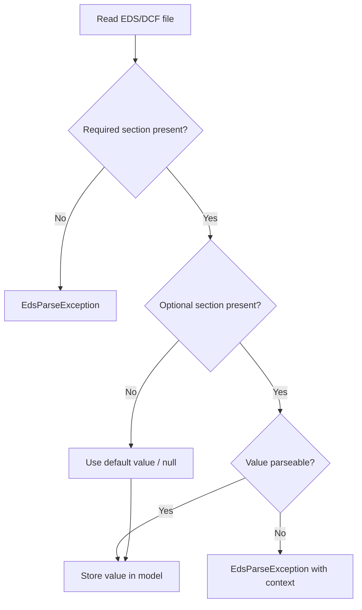
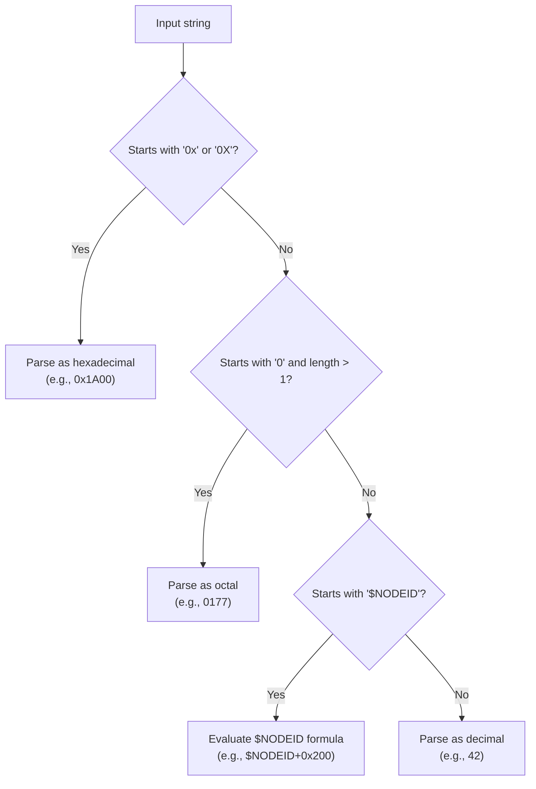
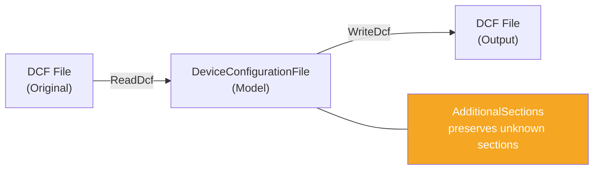
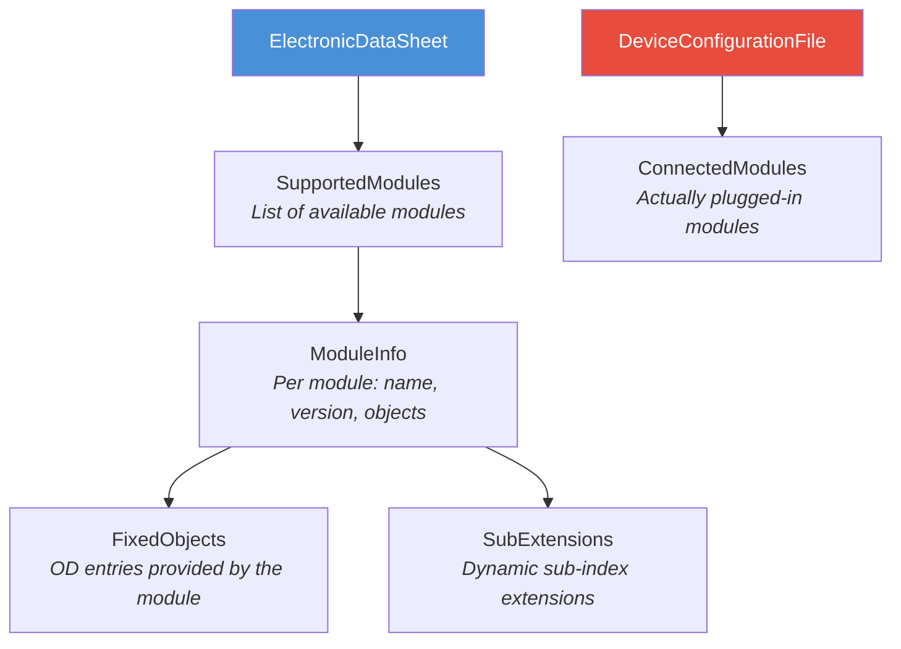
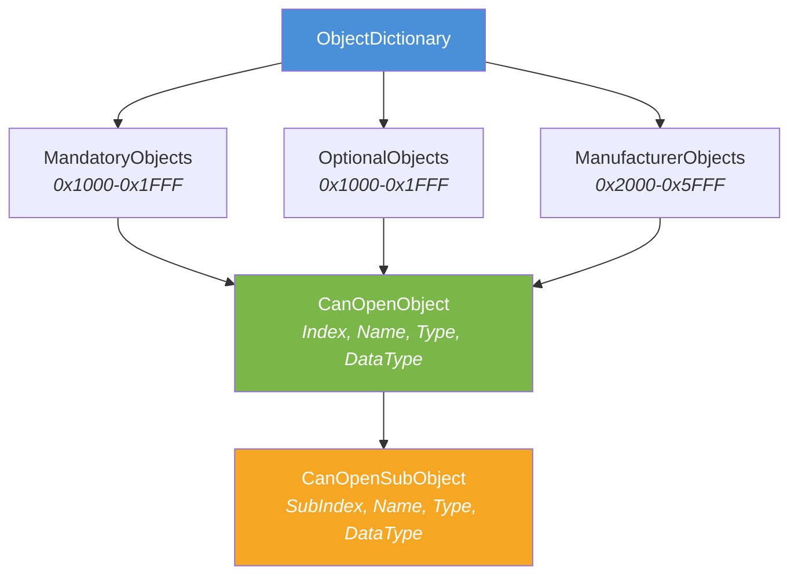

# 8. Crosscutting Concepts

## 8.1 Error Handling

### Strategy

The library uses **exceptions** as its primary error mechanism:

| Exception               | Use Case                                                    | Additional Information       |
|-------------------------|-------------------------------------------------------------|------------------------------|
| `EdsParseException`     | Errors during EDS/DCF parsing                               | `LineNumber`, `SectionName`  |
| `DcfWriteException`     | Errors during DCF writing                                   | `SectionName`                |
| `ArgumentException`     | Invalid input parameters where validation is performed by the API | Standard .NET          |

> **Note:** `CanOpenFile.EdsToDcf` currently accepts any `byte nodeId` value without enforcing the CANopen range (1-127) and therefore does not throw an `ArgumentException` for out-of-range node IDs.

### Error Tolerance



- **Required fields**: Missing required sections result in an `EdsParseException`.
- **Optional fields**: Missing optional values result in `null` or default values.
- **Unknown sections**: Preserved in `AdditionalSections` (no warning, no error).

## 8.2 Culture Independence (InvariantCulture)

EDS/DCF files are culture-independent INI files. Numeric values always use the period as a decimal separator, and there are no localized formats.

### Rule

Every numeric or date-related parse/format operation **must** use `CultureInfo.InvariantCulture`:

```csharp
// Correct
int.TryParse(value, NumberStyles.Integer, CultureInfo.InvariantCulture, out var result);
value.ToString(CultureInfo.InvariantCulture);

// Wrong -- depends on system culture
int.TryParse(value, out var result);
value.ToString();
```

## 8.3 Number Format Processing

The `ValueConverter` supports three number formats specified in CiA DS 306:



### $NODEID Formula

DCF files can contain values computed relative to the node ID:

| Example                 | Node ID = 5 | Result   |
|------------------------|-------------|----------|
| `$NODEID`              | 5           | 5        |
| `$NODEID+0x600`        | 5           | 1541     |
| `$NODEID+0x200`        | 5           | 517      |

## 8.4 Round-Trip Fidelity

A core design principle is **round-trip fidelity**: a DCF file that is read and written back unchanged should not lose any information.



Mechanisms:
- **`AdditionalSections`**: All sections not mapped by the model are stored as raw key-value pairs and written back during output.
- **`LastEds`**: DCF files store the filename of the source EDS.

## 8.5 Modular Devices (CiA DS 306)

CANopen supports modular devices (e.g., bus couplers with pluggable I/O modules). EdsDcfNet fully represents this concept:



## 8.6 CANopen Object Dictionary Structure

The Object Dictionary is the heart of every CANopen device:



### Object Types

| ObjectType | Value | Description                                     |
|------------|-------|-------------------------------------------------|
| VAR        | 0x07  | Single variable                                 |
| ARRAY      | 0x08  | Array with homogeneous sub-objects              |
| RECORD     | 0x09  | Structure with heterogeneous sub-objects        |

### Access Types

| Enum Value           | Abbreviation | Meaning                        |
|----------------------|--------------|--------------------------------|
| `ReadOnly`           | `ro`         | Read only                      |
| `WriteOnly`          | `wo`         | Write only                     |
| `ReadWrite`          | `rw`         | Read and write                 |
| `ReadWriteInput`     | `rwr`        | Read/write (process input)     |
| `ReadWriteOutput`    | `rww`        | Read/write (process output)    |
| `Constant`           | `const`      | Constant, not modifiable       |
