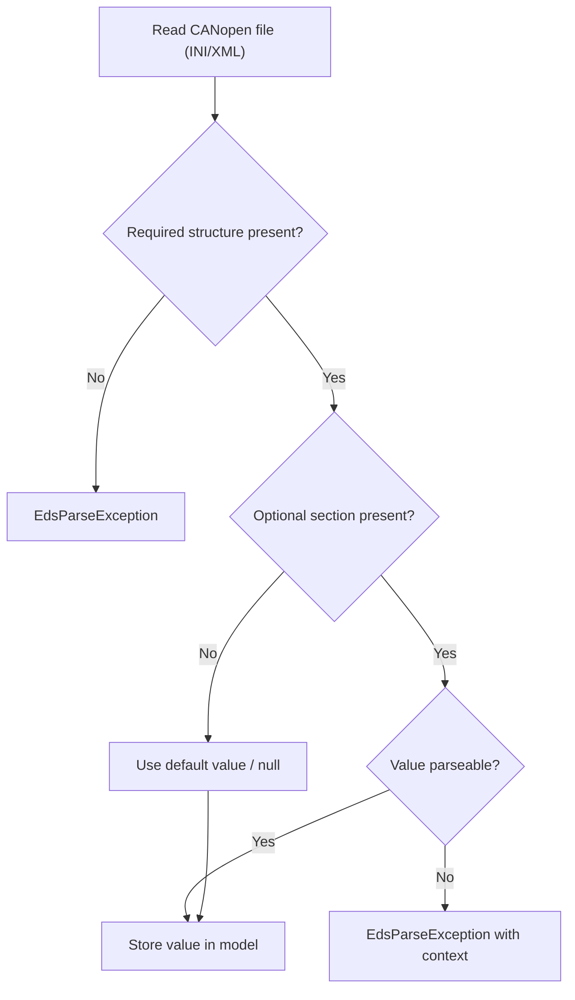
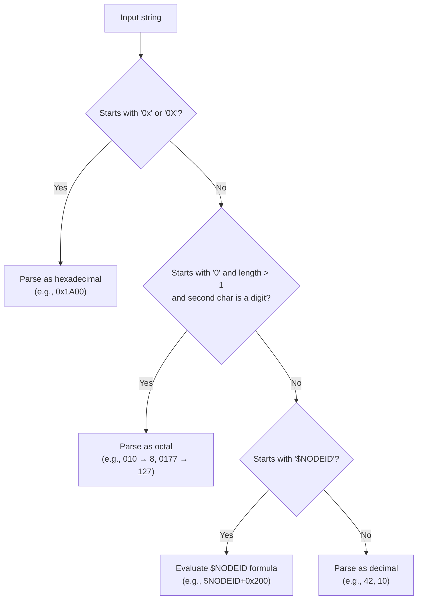
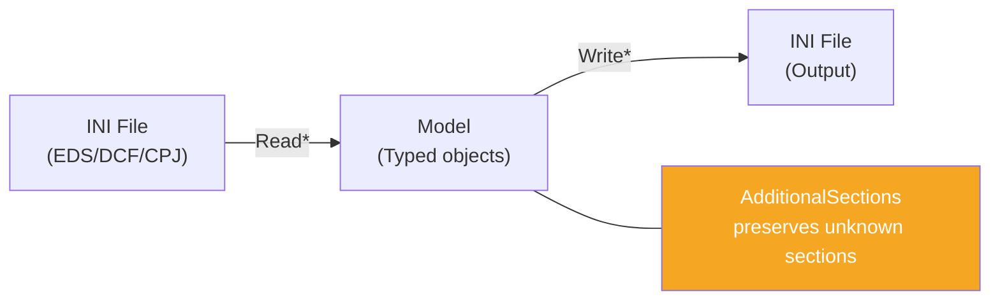
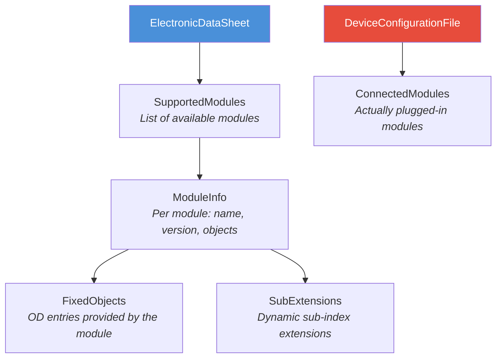
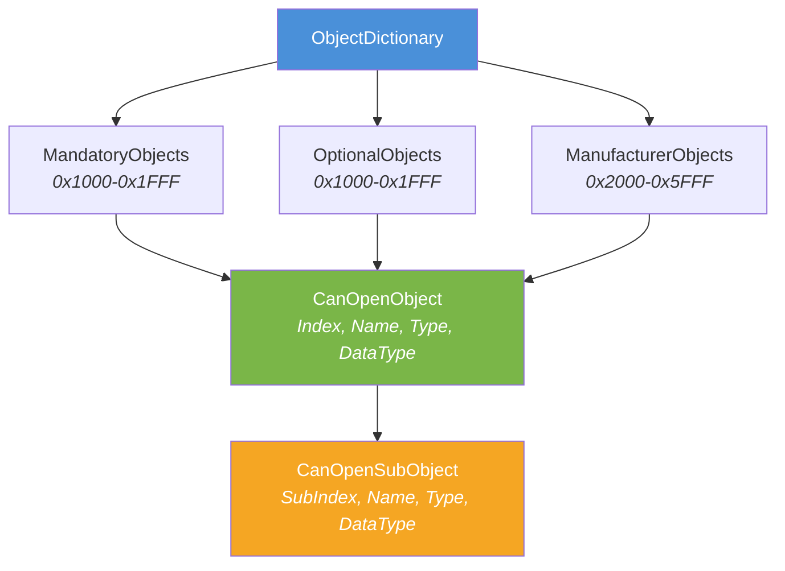

# 8. Crosscutting Concepts

## 8.1 Error Handling

### Strategy

The library uses **exceptions** as its primary error mechanism:

| Exception               | Use Case                                                    | Additional Information       |
|-------------------------|-------------------------------------------------------------|------------------------------|
| `EdsParseException`     | Errors during EDS/DCF/CPJ/XDD/XDC parsing                   | `LineNumber`, `SectionName`  |
| `EdsWriteException`     | Errors during EDS writing                                   | `SectionName`                |
| `DcfWriteException`     | Errors during DCF writing                                   | `SectionName`                |
| `CpjWriteException`     | Errors during CPJ writing                                   | `SectionName`                |
| `XddWriteException`     | Errors during XDD writing                                   | `SectionName`                |
| `XdcWriteException`     | Errors during XDC writing (including commissioning validation) | `SectionName`             |
| `ArgumentException`     | Invalid input parameters where validation is performed by the API | Standard .NET          |

> **Note:** `CanOpenFile.Eds.ConvertToDcf` (and the obsolete `CanOpenFile.EdsToDcf` facade that delegates to it), DCF parsing, and XDC writing enforce CANopen Node-ID constraints for explicit commissioning data. EDS-to-DCF conversion and DCF parsing require `1..127`; XDC writing emits commissioning only when a configured NodeId is present and valid and throws `XdcWriteException` for out-of-range values.

> **Compatibility note (AccessType):** By default, parsing of invalid or unknown
> `AccessType` values is intentionally tolerant and falls back to `ReadOnly`
> instead of failing. Set `CanOpenFileOptions.StrictParsing = true` on facade
> reads to reject unknown EDS/DCF tokens via `ValueConverter.ParseAccessType`
> and unknown XDD/XDC tokens via `ParseXddAccessType`.

### Error Tolerance


```mermaid
flowchart TD
    A["Read CANopen file (INI/XML)"] --> B{Required structure present?}
    B -->|No| C["EdsParseException"]
    B -->|Yes| D{Optional section present?}
    D -->|No| E["Use default value / null"]
    D -->|Yes| F{Value parseable?}
    F -->|No| G["EdsParseException with context"]
    F -->|Yes| H["Store value in model"]
    E --> H
```

- **Required fields**: Missing required sections result in an `EdsParseException`.
- **Optional fields**: Missing optional values result in `null` or default values.
- **Unknown INI sections**: Preserved in `AdditionalSections` (no warning, no error).
- **Duplicate INI keys**: Last write wins by default. With `CanOpenFileOptions.StrictParsing = true` (or `IniParser` `strictParsing: true`), duplicates throw `EdsParseException`.
- **XDD/XDC baud-rate strings**: Unknown `supportedBaudRate`, `actualBaudRate`, and `baudRate/@defaultValue` values map to `0` / are ignored by default. With `StrictParsing = true`, they throw `EdsParseException`.
- **Boolean / AccessType / present-flag tokens**: Lenient defaults unless `StrictParsing = true` on facade reads (`ParseBoolean` / `ParseAccessType` / `ParsePresentFlag`, plus XDD `ParseXddAccessType` / `ParseXmlBool`).
- **FileVersion / FileRevision**: Major/minor tooling forms are accepted unless `StrictParsing = true`. Zero-padded values such as `010` parse as decimal `10` (aligned with XDD `fileVersion`).
- **XDD/XDC OD `index` / `objectType`**: Missing `CANopenObject` `index` defaults to `0x0000` and missing/invalid `objectType` (on objects or sub-objects) defaults to `0x7` (VAR). With `StrictParsing = true`, both throw `EdsParseException`. Present `objectType` values are trimmed and accept schema-valid `xsd:unsignedByte` lexical forms (optional leading sign). Missing `CANopenSubObject` `subIndex` remains lenient (`00`) in both modes.
- **XDD/XDC unsigned numeric attributes**: Malformed `objFlags`, `subNumber`, `pDOmappingIndex`, general-feature counts, and `networkNumber` are ignored by default. With `StrictParsing = true`, they throw `EdsParseException` (whitespace and optional leading sign accepted after trim).
- **CiA 311 XML**: Parsed against supported profile structures; unsupported XML nodes are not represented as generic passthrough data.
- **Direct readers**: `EdsReader` / `DcfReader` / `XddReader` / etc. called without facade options remain lenient (no public StrictParsing switch on those types).

### Input Size Limits

To mitigate memory-pressure and oversized-input scenarios, all read APIs enforce a default
maximum input size of `IniParser.DefaultMaxInputSize` (10 MB).

The limit is configurable per read operation on each format entry point
(`ReadFile`, `ReadFileAsync`, `ReadString`, `ReadStream`, `ReadStreamAsync`)
for EDS/DCF/CPJ/XDD/XDC via `CanOpenFileOptions`.

Guideline: keep the default for untrusted inputs and raise limits only as needed for
trusted, known-large payloads.

### XML Nesting Depth Limits (XDD/XDC)

`SecureXmlParser` additionally caps `XmlReader.Depth` when loading XDD/XDC documents
(default **64**). Deeply nested but still small well-formed trees can otherwise cause
high CPU cost under the size limit alone. Typical CiA 311 profiles are far shallower
(around depth 8). Exceeding the limit fails with `EdsParseException` during parse.

## 8.2 Culture Independence (InvariantCulture)

CANopen INI/XML files are culture-independent. Numeric values use deterministic formats and must not depend on OS locale.

### Rule

Every numeric or date-related parse/format operation **must** use `CultureInfo.InvariantCulture`:

```csharp
// Correct
int.TryParse(value, NumberStyles.Integer, CultureInfo.InvariantCulture, out var result);
value.ToString(CultureInfo.InvariantCulture);

// Wrong -- depends on system culture
int.TryParse(value, out var result);
value.ToString();
```

## 8.3 Number Format Processing

The `ValueConverter` (and typed OD conversion via `CanOpenValueConverter`) supports three
integer literal forms aligned with the C-style conventions used by CiA DS 306 tooling:


```mermaid
flowchart TD
    A["Input string"] --> B{"Starts with '0x' or '0X'?"}
    B -->|Yes| C["Parse as hexadecimal<br/>(e.g., 0x1A00)"]
    B -->|No| D{"Starts with '0' and length > 1<br/>and second char is a digit?"}
    D -->|Yes| E["Parse as octal<br/>(e.g., 010 → 8, 0177 → 127)"]
    D -->|No| F{"Starts with '$NODEID'?"}
    F -->|Yes| G["Evaluate $NODEID formula<br/>(e.g., $NODEID+0x200)"]
    F -->|No| H["Parse as decimal<br/>(e.g., 42, 10)"]
```

### Leading-zero decision (#411)

| Literal | Interpreted as | Result |
|---------|----------------|--------|
| `10` | decimal | 10 |
| `010` | **octal** | 8 |
| `08` / `09` | invalid octal | parse error (`EdsParseException`) |
| `0x10` | hexadecimal | 16 |

**Decision (current major line):** keep automatic octal for `0`+digit on object-dictionary
and general numeric fields. Hexadecimal requires an explicit `0x` / `0X` prefix.
Zero-padded *decimal* values in real EDS/DCF files (for example `DefaultValue=010`
meaning ten) are therefore misread unless authors use unpadded decimal (`10`) or
hex (`0x0A`).

**Exception — `FileVersion` / `FileRevision`:** these metadata fields use plain
decimal parsing (aligned with XDD `fileVersion`), so `FileVersion=010` → `10` on
EDS, DCF, and XDD alike. General OD values still follow the octal rule above.

Changing the default OD rule to “leading zeros are decimal” would be a **breaking**
behavior change for callers that rely on C-style octal; that switch is deferred to a
planned major release or a dedicated opt-in, not done as a silent patch.

### $NODEID Formula

DCF files can contain values computed relative to the node ID:

| Example                 | Node ID = 5 | Result   |
|------------------------|-------------|----------|
| `$NODEID`              | 5           | 5        |
| `$NODEID+0x600`        | 5           | 1541     |
| `$NODEID+0x200`        | 5           | 517      |

## 8.4 Round-Trip Fidelity

A core design principle is **round-trip fidelity**: EDS/DCF/CPJ files that are read and written back unchanged should not lose any information.


```mermaid
flowchart LR
    A["INI File<br/>(EDS/DCF/CPJ)"] -->|Read*| B["Model<br/>(Typed objects)"]
    B -->|Write*| C["INI File<br/>(Output)"]

    B --- D["AdditionalSections<br/>preserves unknown sections"]

    style D fill:#F5A623,color:#fff
```

Mechanisms (INI formats):
- **`AdditionalSections`**: All sections not mapped by the model are stored as raw key-value pairs and written back during output.
- **`LastEds`**: DCF files store the filename of the source EDS.

For CiA 311 XML, round-trip behavior is guaranteed for the currently mapped schema subset used by `XddReader`/`XdcReader` and `XddWriter`/`XdcWriter`.

`AdditionalSections` remains an **INI-shaped** `Dictionary<string, Dictionary<string, string>>`. Unknown children of the **CommunicationNetwork** `ProfileBody` are captured as attribute-only key/value maps for in-memory inspection and XDC→EDS bridging; nested XML content is discarded. Unknown children of the Device `ProfileBody` are not captured. `XddWriter`/`XdcWriter` rebuild a fixed CommunicationNetwork ProfileBody (`ApplicationLayers` / `TransportLayers` / `NetworkManagement`) without re-emitting those entries. Do not treat `AdditionalSections` as an XDD/XDC vendor-extension round-trip store.

## 8.5 CiA 311 XML Mapping

CiA 311 support is implemented through explicit mapping of ISO 15745 profile elements to shared domain models:

- `CANopenObject` / `CANopenSubObject` attributes map to Object Dictionary objects/sub-objects.
- XDC `actualValue` and `denotation` map to `ParameterValue` and `Denotation`.
- `deviceCommissioning` maps to `DeviceCommissioning`.

XDC writer behavior:
- NodeId `0` means "commissioning not configured" and omits the XML `deviceCommissioning` element.
- NodeId `1..127` emits a valid `deviceCommissioning` element.
- Out-of-range NodeId values cause an `XdcWriteException`.
- CiA 311 `deviceCommissioning` attributes are limited to `nodeID`, `nodeName`,
  `actualBaudRate`, `networkNumber`, `networkName`, and `CANopenManager`.
  DCF-only fields `LSS_SerialNumber`, `NodeRefd`, and `NetRefd`
  (`DeviceCommissioning.LssSerialNumber` / `NodeRefd` / `NetRefd`) have no
  schema equivalent and are intentionally omitted on XDC write (including
  DCF→XDC conversion). Use DCF/CPJ when those values must be preserved.

## 8.6 Modular Devices (CiA DS 306)

CANopen supports modular devices (e.g., bus couplers with pluggable I/O modules). EdsDcfNet fully represents this concept:


```mermaid
graph TD
    EDS["ElectronicDataSheet"]
    SM["SupportedModules<br/><i>List of available modules</i>"]
    MI["ModuleInfo<br/><i>Per module: name, version, objects</i>"]
    FO["FixedObjects<br/><i>OD entries provided by the module</i>"]
    SE["SubExtensions<br/><i>Dynamic sub-index extensions</i>"]

    DCF["DeviceConfigurationFile"]
    CM["ConnectedModules<br/><i>Actually plugged-in modules</i>"]

    EDS --> SM
    SM --> MI
    MI --> FO
    MI --> SE
    DCF --> CM

    style EDS fill:#4A90D9,color:#fff
    style DCF fill:#E74C3C,color:#fff
```

## 8.7 CANopen Object Dictionary Structure

The Object Dictionary is the heart of every CANopen device:


```mermaid
graph TD
    OD["ObjectDictionary"]
    MO["MandatoryObjects<br/><i>0x1000-0x1FFF</i>"]
    OO["OptionalObjects<br/><i>0x1000-0x1FFF</i>"]
    MF["ManufacturerObjects<br/><i>0x2000-0x5FFF</i>"]

    OBJ["CanOpenObject<br/><i>Index, Name, Type, DataType</i>"]
    SUB["CanOpenSubObject<br/><i>SubIndex, Name, Type, DataType</i>"]

    OD --> MO
    OD --> OO
    OD --> MF
    MO --> OBJ
    OO --> OBJ
    MF --> OBJ
    OBJ --> SUB

    style OD fill:#4A90D9,color:#fff
    style OBJ fill:#7AB648,color:#fff
    style SUB fill:#F5A623,color:#fff
```

### Object Types

| ObjectType | Value | Description                                     |
|------------|-------|-------------------------------------------------|
| VAR        | 0x07  | Single variable                                 |
| ARRAY      | 0x08  | Array with homogeneous sub-objects              |
| RECORD     | 0x09  | Structure with heterogeneous sub-objects        |

### Access Types

| Enum Value           | Abbreviation | Meaning                        |
|----------------------|--------------|--------------------------------|
| `ReadOnly`           | `ro`         | Read only                      |
| `WriteOnly`          | `wo`         | Write only                     |
| `ReadWrite`          | `rw`         | Read and write                 |
| `ReadWriteInput`     | `rwr`        | Read/write (process input)     |
| `ReadWriteOutput`    | `rww`        | Read/write (process output)    |
| `Constant`           | `const`      | Constant, not modifiable       |
