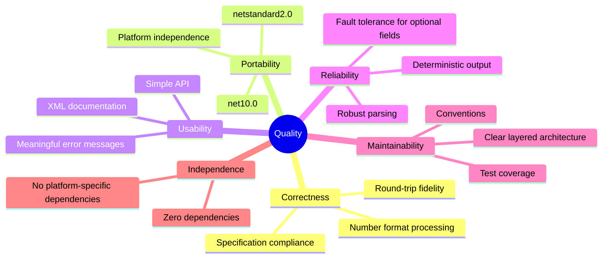

# 10. Quality Requirements

## 10.1 Quality Tree

## 10.2 Quality Scenarios

### Scenario 1: Specification Compliance

| Aspect           | Description                                                                |
|------------------|----------------------------------------------------------------------------|
| **Stimulus**     | An EDS file conforming to CiA DS 306 v1.4 is read.                        |
| **Environment**  | Regular library operation.                                                 |
| **Response**     | All specified sections and fields are correctly interpreted.               |
| **Metric**       | 100% of sections defined in the specification are supported.               |

### Scenario 2: Platform Compatibility

| Aspect           | Description                                                                |
|------------------|----------------------------------------------------------------------------|
| **Stimulus**     | The library is referenced in a .NET Framework 4.6.1 project.               |
| **Environment**  | Windows development machine with Visual Studio.                            |
| **Response**     | Compilation and execution without errors.                                  |
| **Metric**       | Successful compilation against `netstandard2.0` without warnings.          |

### Scenario 3: Culture Independence

| Aspect           | Description                                                                |
|------------------|----------------------------------------------------------------------------|
| **Stimulus**     | An EDS file with hexadecimal values is read on a system with German culture. |
| **Environment**  | Operating system with `de-DE` as default culture.                          |
| **Response**     | Values are parsed correctly, no culture-related errors.                    |
| **Metric**       | Identical results regardless of system culture.                            |

### Scenario 4: Round-Trip Fidelity

| Aspect           | Description                                                                |
|------------------|----------------------------------------------------------------------------|
| **Stimulus**     | A DCF file with vendor-specific sections is read and written back unchanged. |
| **Environment**  | Regular library operation.                                                 |
| **Response**     | Vendor-specific sections are preserved in the output file.                 |
| **Metric**       | No information loss in `AdditionalSections`.                               |

### Scenario 5: Meaningful Error Messages

| Aspect           | Description                                                                |
|------------------|----------------------------------------------------------------------------|
| **Stimulus**     | An EDS file with an invalid value in section `[1000]` is read.             |
| **Environment**  | Regular library operation.                                                 |
| **Response**     | `EdsParseException` is thrown with `SectionName = "1000"` and optionally `LineNumber`. |
| **Metric**       | Errors can be localized within 30 seconds.                                 |

## 10.3 Test Coverage

Quality is ensured through automated tests:

| Test Category            | Test Class                       | Focus                                             |
|--------------------------|----------------------------------|---------------------------------------------------|
| **Unit tests**           | `ValueConverterTests`            | Number formats, booleans, AccessType conversion   |
| **Unit tests**           | `IniParserTests`                 | INI parsing, sections, comments                   |
| **Unit tests**           | `EdsReaderTests`                 | EDS sections, ObjectDictionary                    |
| **Unit tests**           | `DcfReaderTests`                 | DCF-specific sections                             |
| **Unit tests**           | `DcfWriterTests`                 | DCF output and formatting                         |
| **Unit tests**           | `ModelInitializationTests`       | Model defaults and instantiation                  |
| **Unit tests**           | `ObjectDictionaryExtensionsTests`| Extension method behavior                         |
| **Unit tests**           | `EdsParseExceptionTests`         | Exception constructors and properties             |
| **Unit tests**           | `DcfWriteExceptionTests`         | Exception constructors and properties             |
| **Integration tests**    | `CanOpenFileTests`               | End-to-end: read file, verify model               |
| **Integration tests**    | `RoundTripDcfTests`              | Read -> write -> read again                       |
